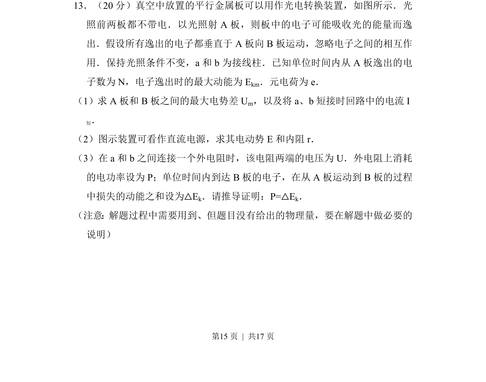
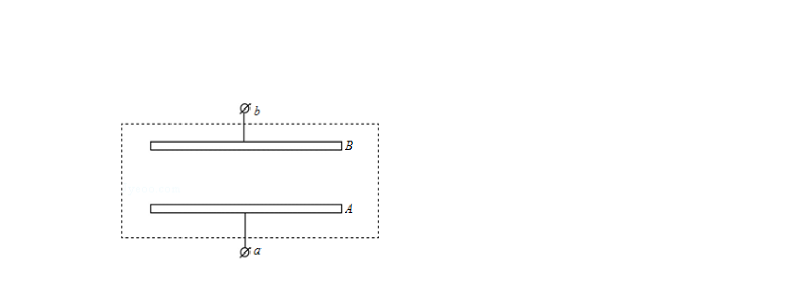
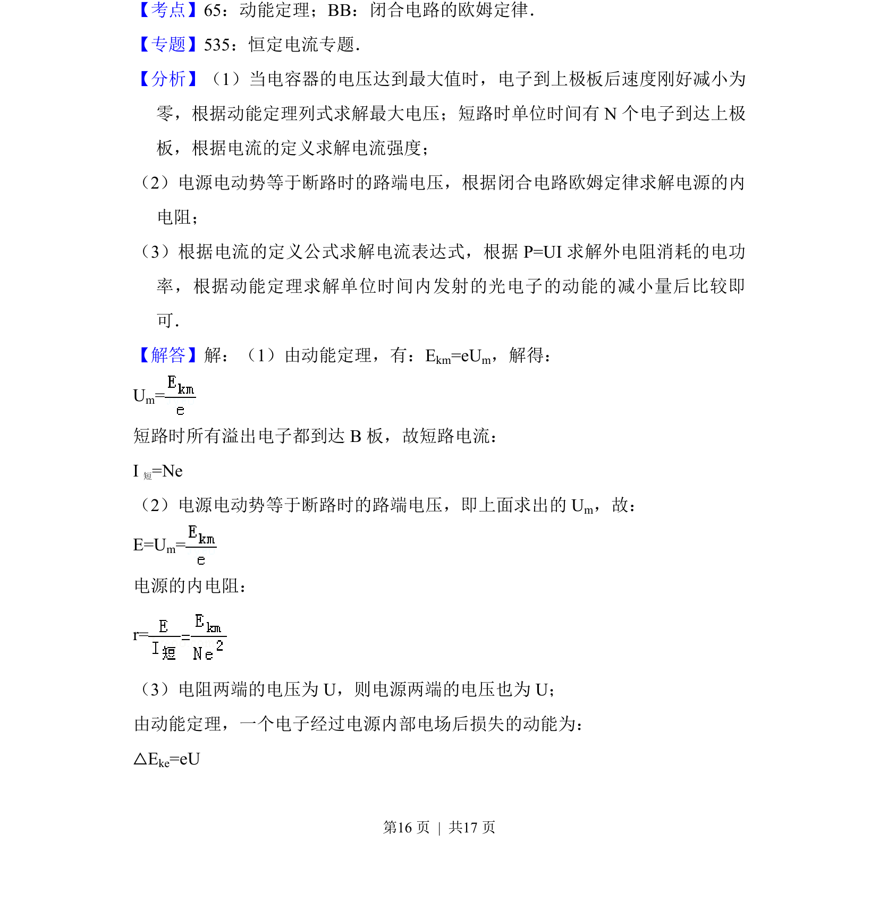
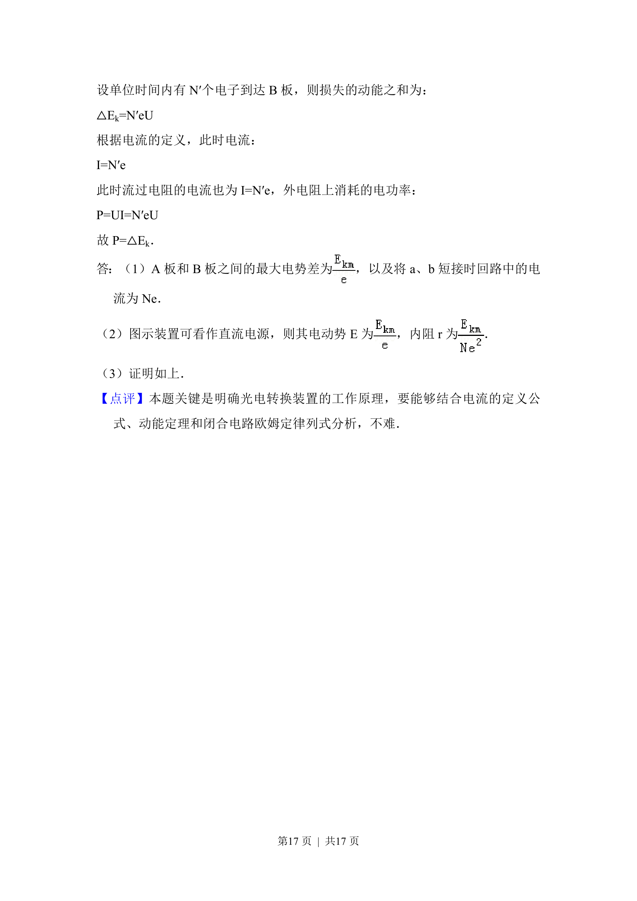

## 题面

## 摘要

该题以光电转换装置为背景，考查光电效应、电势差、电流、电源电动势与内阻及能量守恒的推导证明。

## 关联考点

- [[417-光电效应|光电效应]]
- [[332-闭合电路欧姆定律|闭合电路欧姆定律]]
- [[251-动能定理|动能定理]]
- [[197-能量守恒定律|能量守恒]]

## 答案与解析

> 📄 原 PDF 第 15 页：`素材/真题/北京/2008-2024·（北京）物理高考真题/2015年高考物理试卷（北京）（解析卷）.pdf`
