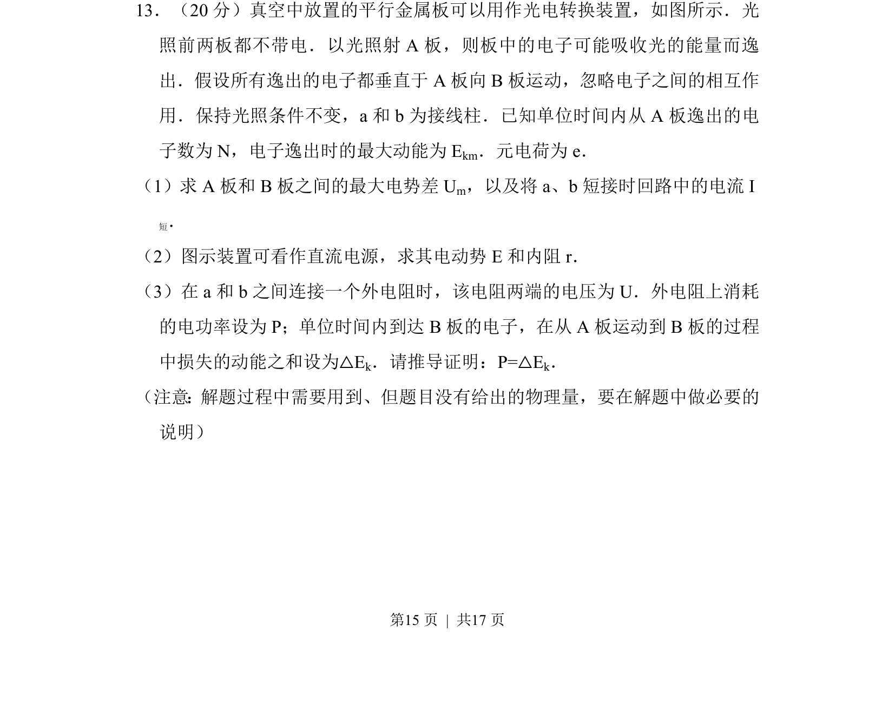
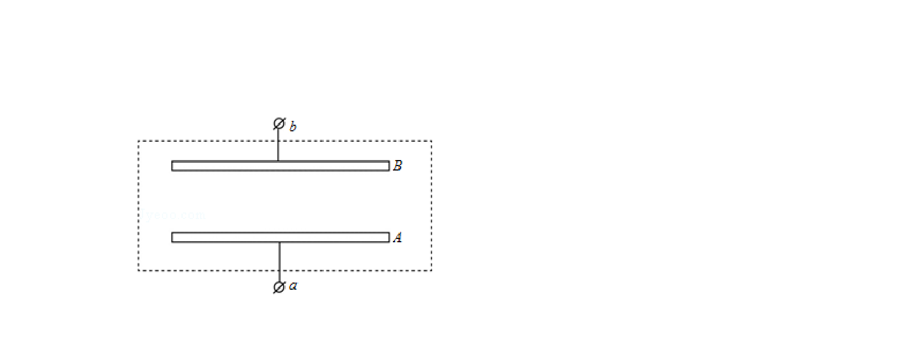
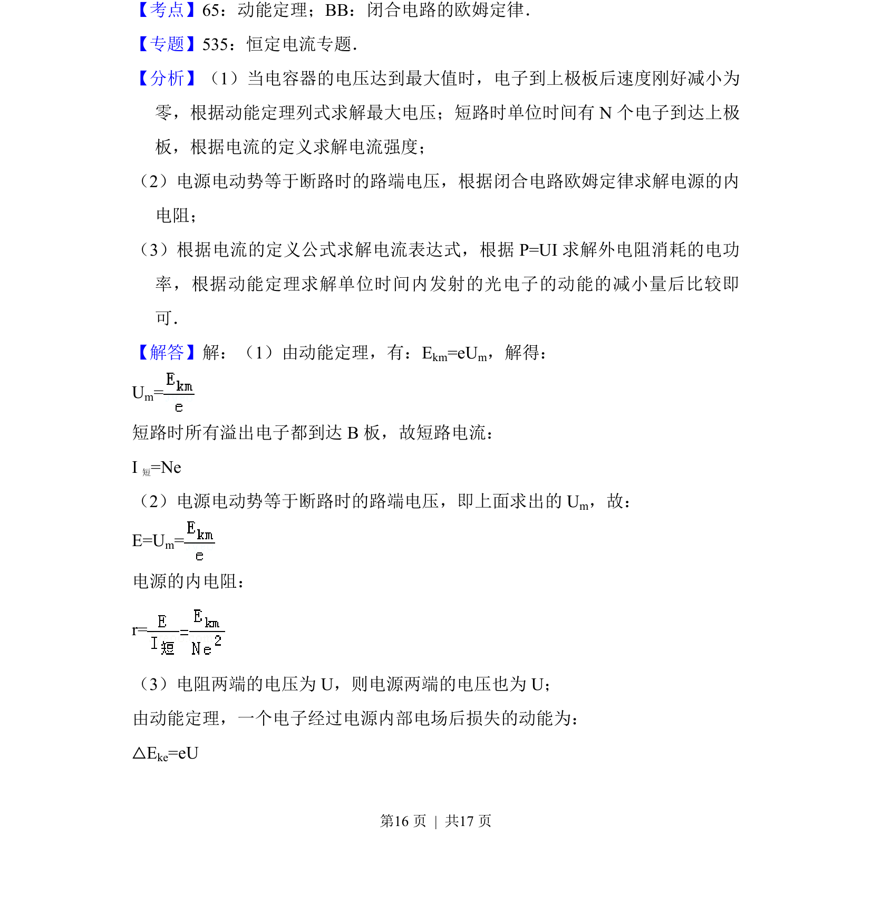
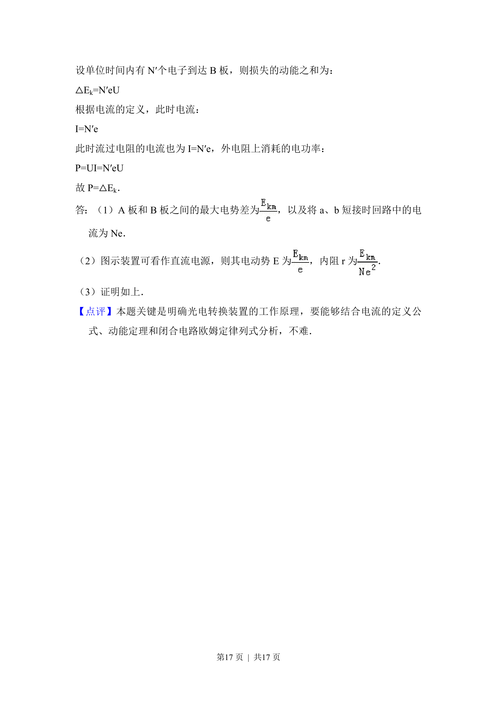

## 题面

## 摘要

该题以光电转换装置为背景，考查光电效应、电势差、电流、电源电动势与内阻及能量守恒的推导证明。

## 关联考点

- [[417-光电效应|光电效应]]
- [[332-闭合电路欧姆定律|闭合电路欧姆定律]]
- [[251-动能定理|动能定理]]
- [[197-能量守恒定律|能量守恒]]

## 答案与解析

> 📄 原 PDF 第 15 页：`素材/真题/北京/2008-2024·（北京）物理高考真题/2015年高考物理试卷（北京）（解析卷）.pdf`

<!-- 题干文本-start -->
## 题干文本
13．（20分）真空中放置的平行金属板可以用作光电转换装置，如图所示．光
照前两板都不带电．以光照射A板，则板中的电子可能吸收光的能量而逸
出．假设所有逸出的电子都垂直于A板向B板运动，忽略电子之间的相互作
用．保持光照条件不变，a和b为接线柱．已知单位时间内从A板逸出的电
子数为N，电子逸出时的最大动能为E km．元电荷为e．
（1）求A板和B板之间的最大电势差U m，以及将a、b短接时回路中的电流I
短．
（2）图示装置可看作直流电源，求其电动势E和内阻r．
（3）在a和b之间连接一个外电阻时，该电阻两端的电压为U．外电阻上消耗
的电功率设为P；单位时间内到达B板的电子，在从A板运动到B板的过程
中损失的动能之和设为△Ek．请推导证明：P=△Ek．
（注意：解题过程中需要用到、但题目没有给出的物理量，要在解题中做必要的
说明）
<!-- 题干文本-end -->

<!-- 解析文本-start -->
## 解析文本

<!-- 解析文本-end -->
