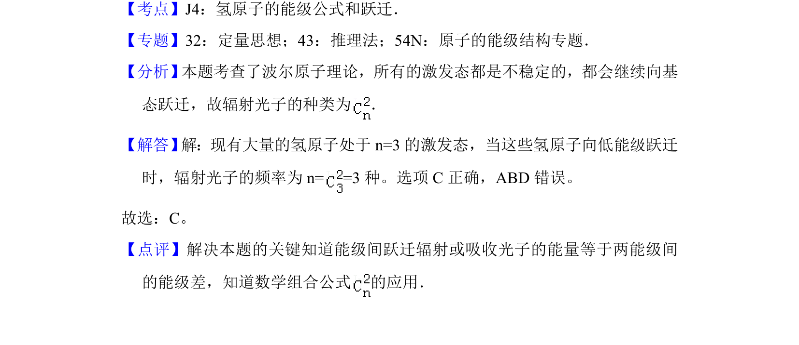

## 题面

## 摘要

大量氢原子从n=3能级向低能级跃迁，辐射光子频率种类计算。

## 关联考点

- [[758-氢原子能级跃迁|氢原子能级跃迁]]
- [[组合公式]]
- [[辐射光子频率]]

## 答案与解析

> 📄 原 PDF 第 1 页：`素材/真题/北京/2008-2024·（北京）物理高考真题/2016年高考物理试卷（北京）（解析卷）.pdf`

<!-- 题干文本-start -->
## 题干文本
1． （6分） 处于n=3能级的大量氢原子， 向低能级跃迁时， 辐射光的频率有 （　　）
A．1种B．2种C．3种D．4种
<!-- 题干文本-end -->

<!-- 解析文本-start -->
## 解析文本
【考点】J4：氢原子的能级公式和跃迁．菁优网版权所有
【专题】32：定量思想；43：推理法；54N：原子的能级结构专题．
【分析】 本题考查了波尔原子理论，所有的激发态都是不稳定的，都会继续向基
态跃迁，故辐射光子的种类为 ．
【解答】 解：现有大量的氢原子处于n=3的激发态，当这些氢原子向低能级跃迁
时，辐射光子的频率为n= =3种。选项C正确，ABD错误。
故选：C。
【点评】解决本题的关键知道能级间跃迁辐射或吸收光子的能量等于两能级间
的能级差，知道数学组合公式 的应用．
<!-- 解析文本-end -->
