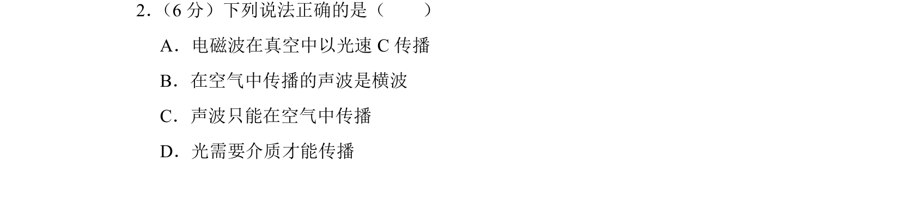
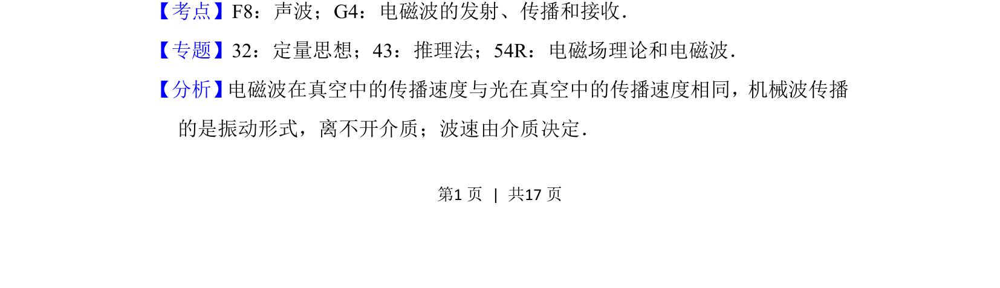
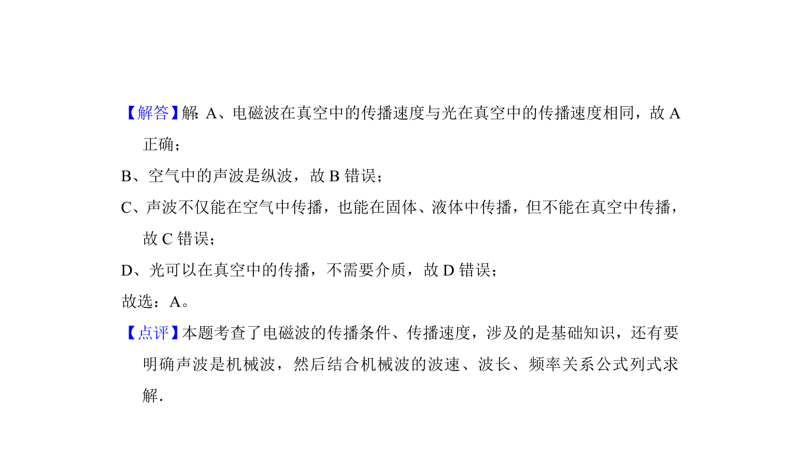

## 题面

## 摘要

该题考查电磁波和声波的传播特性，判断关于传播速度、介质和波形的说法正误。

## 关联考点

- [[176-电磁波|电磁波]]
- [[声波]]
- [[363-横波与纵波|横波]]
- [[介质]]

## 答案与解析

> 📄 原 PDF 第 1 页：`素材/真题/北京/2008-2024·（北京）物理高考真题/2016年高考物理试卷（北京）（解析卷）.pdf`
