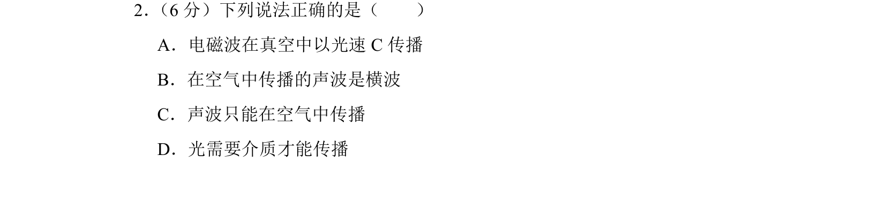
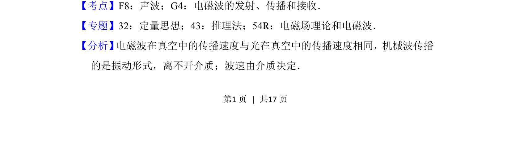
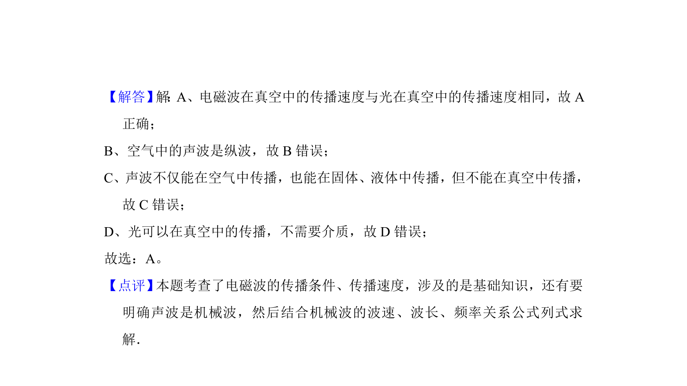

## 题面

## 摘要

该题考查电磁波和声波的传播特性，判断关于传播速度、介质和波形的说法正误。

## 关联考点

- [[176-电磁波|电磁波]]
- [[声波]]
- [[363-横波与纵波|横波]]
- [[介质]]

## 答案与解析

> 📄 原 PDF 第 1 页：`素材/真题/北京/2008-2024·（北京）物理高考真题/2016年高考物理试卷（北京）（解析卷）.pdf`

<!-- 题干文本-start -->
## 题干文本
2． （6分）下列说法正确的是（　　）
A．电磁波在真空中以光速C传播
B．在空气中传播的声波是横波
C．声波只能在空气中传播
D．光需要介质才能传播
<!-- 题干文本-end -->

<!-- 解析文本-start -->
## 解析文本
【考点】F8：声波；G4：电磁波的发射、传播和接收．菁优网版权所有
【专题】32：定量思想；43：推理法；54R：电磁场理论和电磁波．
【分析】 电磁波在真空中的传播速度与光在真空中的传播速度相同，机械波传播
的是振动形式，离不开介质；波速由介质决定．
<!-- 解析文本-end -->
