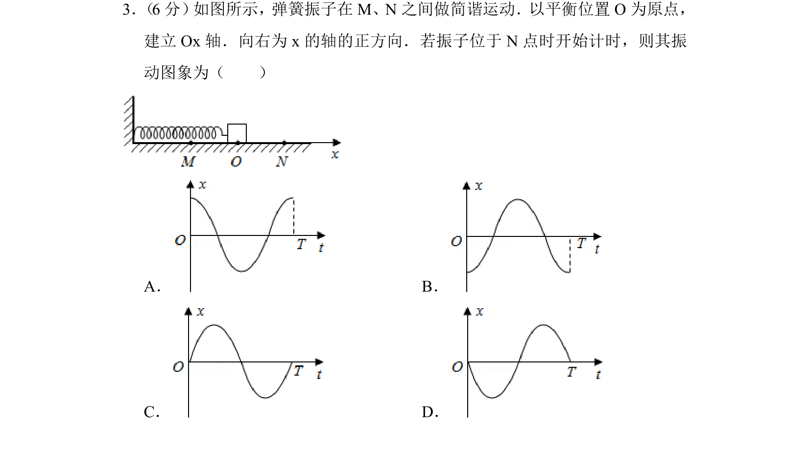
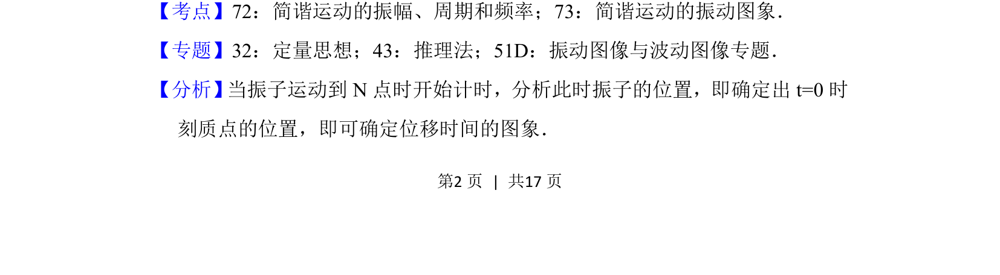
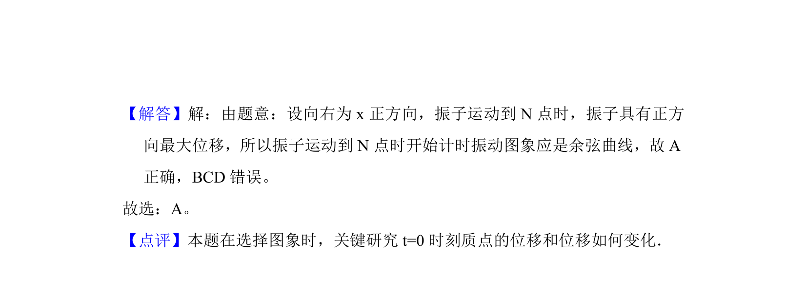

## 题面

## 摘要

根据简谐运动规律，判断从最大位移处开始计时的振动图像。

## 关联考点

- [[简谐运动的振动图象]]
- [[简谐运动的振幅]]
- [[周期和频率]]

## 答案与解析

> 📄 原 PDF 第 2 页：`素材/真题/北京/2008-2024·（北京）物理高考真题/2016年高考物理试卷（北京）（解析卷）.pdf`

<!-- 题干文本-start -->
## 题干文本
3． （6分） 如图所示，弹簧振子在M、N之间做简谐运动．以平衡位置O为原点，
建立Ox轴．向右为x的轴的正方向．若振子位于N点时开始计时，则其振
动图象为（　　）
A．B．
C．D．
<!-- 题干文本-end -->

<!-- 解析文本-start -->
## 解析文本
【考点】72：简谐运动的振幅、周期和频率；73：简谐运动的振动图象．菁优网版权所有
【专题】32：定量思想；43：推理法；51D：振动图像与波动图像专题．
【分析】 当振子运动到N点时开始计时，分析此时振子的位置，即确定出t=0时
刻质点的位置，即可确定位移时间的图象．
<!-- 解析文本-end -->
