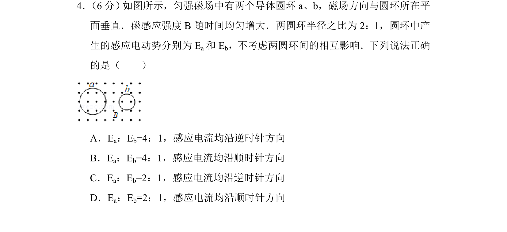
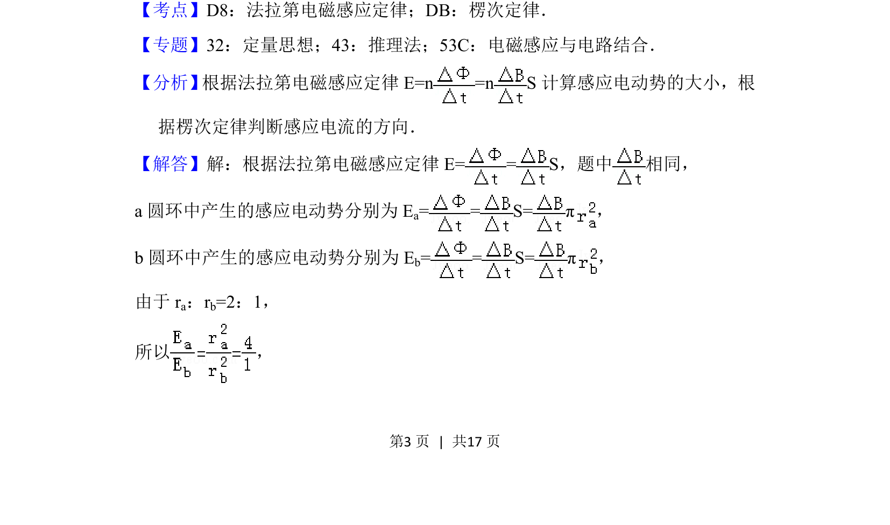
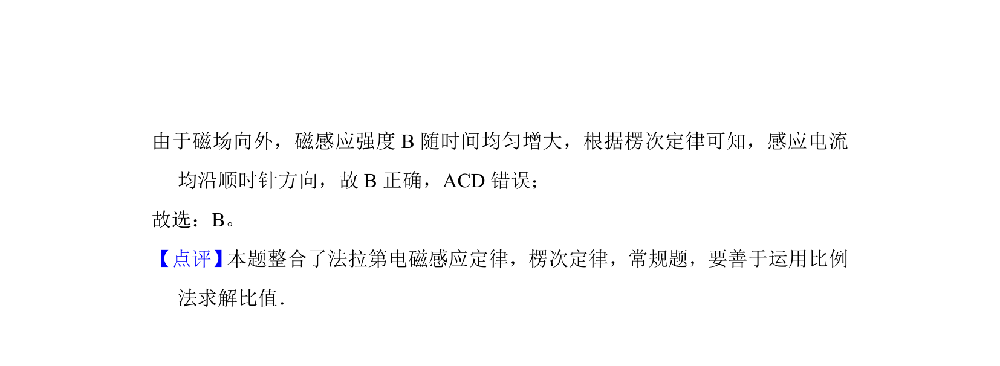

## 题面

## 摘要

本题考查法拉第电磁感应定律计算感应电动势及楞次定律判断感应电流方向。

## 关联考点

- [[395-法拉第电磁感应定律|法拉第电磁感应定律]]
- [[393-楞次定律|楞次定律]]

## 答案与解析

> 📄 原 PDF 第 3 页：`素材/真题/北京/2008-2024·（北京）物理高考真题/2016年高考物理试卷（北京）（解析卷）.pdf`

<!-- 题干文本-start -->
## 题干文本
4． （6分） 如图所示，匀强磁场中有两个导体圆环a、b，磁场方向与圆环所在平
面垂直．磁感应强度B随时间均匀增大．两圆环半径之比为2：1，圆环中产
生的感应电动势分别为E a和E b，不考虑两圆环间的相互影响．下列说法正确
的是（　　）
A．Ea：Eb=4：1，感应电流均沿逆时针方向
B．Ea：Eb=4：1，感应电流均沿顺时针方向
C．Ea：Eb=2：1，感应电流均沿逆时针方向
D．Ea：Eb=2：1，感应电流均沿顺时针方向
<!-- 题干文本-end -->

<!-- 解析文本-start -->
## 解析文本
【考点】D8：法拉第电磁感应定律；DB：楞次定律．菁优网版权所有
【专题】32：定量思想；43：推理法；53C：电磁感应与电路结合．
【分析】 根据法拉第电磁感应定律E=n =n S计算感应电动势的大小，根
据楞次定律判断感应电流的方向．
【解答】解：根据法拉第电磁感应定律E= = S，题中 相同，
a圆环中产生的感应电动势分别为E a= = S=π，
b圆环中产生的感应电动势分别为E b= = S=π，
由于r a：rb=2：1，
所以 ，
<!-- 解析文本-end -->
