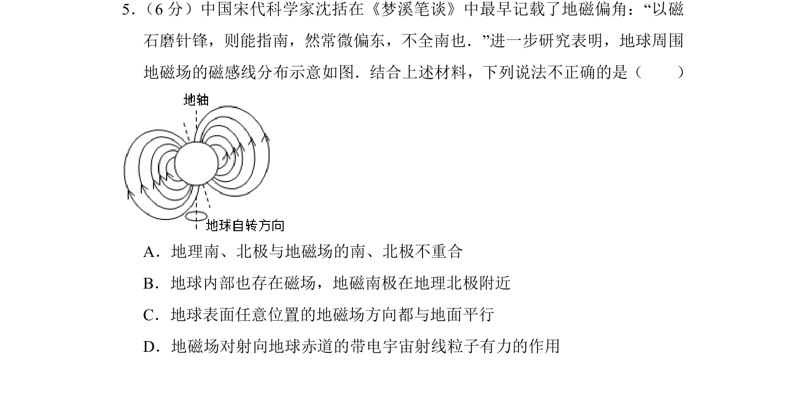
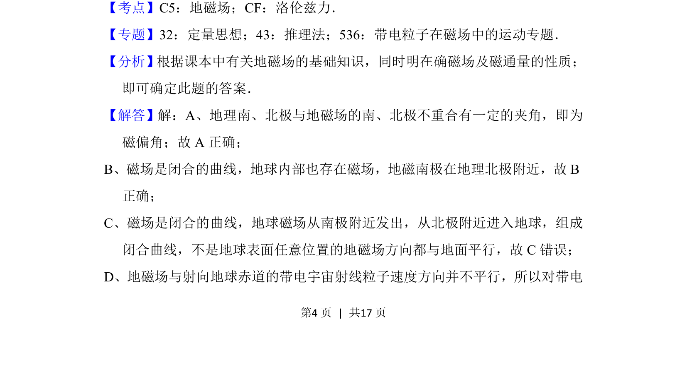
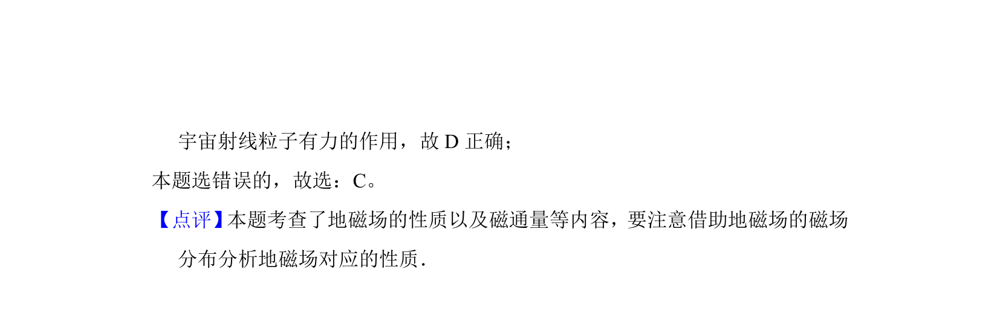

## 题面

## 摘要

考查地磁场的基本概念及洛伦兹力，判断关于地磁场方向的错误说法

## 关联考点

- [[132-地磁场|地磁场]]
- [[304-洛伦兹力|洛伦兹力]]
- [[磁偏角]]

## 答案与解析

> 📄 原 PDF 第 4 页：`素材/真题/北京/2008-2024·（北京）物理高考真题/2016年高考物理试卷（北京）（解析卷）.pdf`

<!-- 题干文本-start -->
## 题干文本
5． （6分）中国宋代科学家沈括在《梦溪笔谈》中最早记载了地磁偏角：“以磁
石磨针锋，则能指南，然常微偏东，不全南也．”进一步研究表明，地球周围
地磁场的磁感线分布示意如图．结合上述材料，下列说法不正确的是（　　）
A．地理南、北极与地磁场的南、北极不重合
B．地球内部也存在磁场，地磁南极在地理北极附近
C．地球表面任意位置的地磁场方向都与地面平行
D．地磁场对射向地球赤道的带电宇宙射线粒子有力的作用
<!-- 题干文本-end -->

<!-- 解析文本-start -->
## 解析文本
【考点】C5：地磁场；CF：洛伦兹力．菁优网版权所有
【专题】32：定量思想；43：推理法；536：带电粒子在磁场中的运动专题．
【分析】根据课本中有关地磁场的基础知识，同时明在确磁场及磁通量的性质；
即可确定此题的答案．
【解答】解：A、地理南、北极与地磁场的南、北极不重合有一定的夹角，即为
磁偏角；故A正确；
B、磁场是闭合的曲线，地球内部也存在磁场，地磁南极在地理北极附近，故B
正确；
C、磁场是闭合的曲线，地球磁场从南极附近发出，从北极附近进入地球，组成
闭合曲线，不是地球表面任意位置的地磁场方向都与地面平行，故C错误；
D、地磁场与射向地球赤道的带电宇宙射线粒子速度方向并不平行，所以对带电
<!-- 解析文本-end -->
