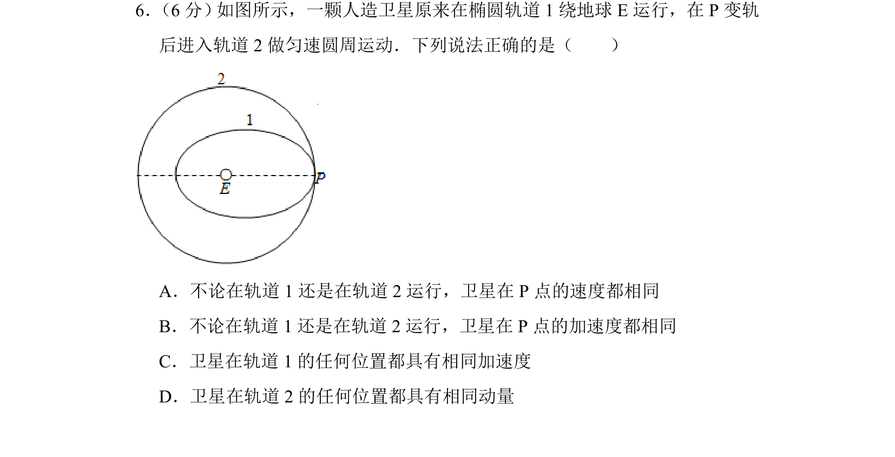
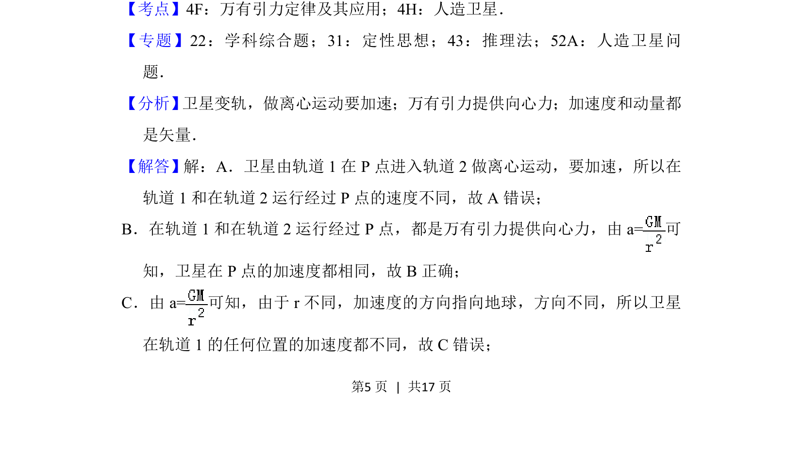
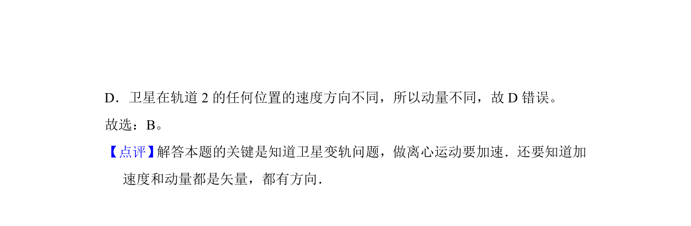

## 题面

## 摘要

卫星变轨问题，比较椭圆轨道和圆轨道上P点的速度、加速度及不同位置的加速度和动量

## 关联考点

- [[834-万有引力定律及其应用|万有引力定律及其应用]]
- [[836-人造卫星|人造卫星]]
- [[变轨]]
- [[257-向心加速度|向心加速度]]

## 答案与解析

> 📄 原 PDF 第 5 页：`素材/真题/北京/2008-2024·（北京）物理高考真题/2016年高考物理试卷（北京）（解析卷）.pdf`

<!-- 题干文本-start -->
## 题干文本
6． （6分） 如图所示，一颗人造卫星原来在椭圆轨道1绕地球E运行，在P变轨
后进入轨道2做匀速圆周运动．下列说法正确的是（　　）
A．不论在轨道1还是在轨道2运行，卫星在P点的速度都相同
B．不论在轨道1还是在轨道2运行，卫星在P点的加速度都相同
C．卫星在轨道1的任何位置都具有相同加速度
D．卫星在轨道2的任何位置都具有相同动量
<!-- 题干文本-end -->

<!-- 解析文本-start -->
## 解析文本
【考点】4F：万有引力定律及其应用；4H：人造卫星．菁优网版权所有
【专题】22：学科综合题；31：定性思想；43：推理法；52A：人造卫星问
题．
【分析】 卫星变轨，做离心运动要加速；万有引力提供向心力；加速度和动量都
是矢量．
【解答】解：A．卫星由轨道1在P点进入轨道2做离心运动，要加速，所以在
轨道1和在轨道2运行经过P点的速度不同，故A错误；
B．在轨道1和在轨道2运行经过P点，都是万有引力提供向心力，由a=可
知，卫星在P点的加速度都相同，故B正确；
C．由a=可知，由于r不同，加速度的方向指向地球，方向不同，所以卫星
在轨道1的任何位置的加速度都不同，故C错误；
<!-- 解析文本-end -->
