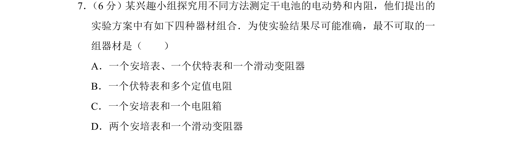
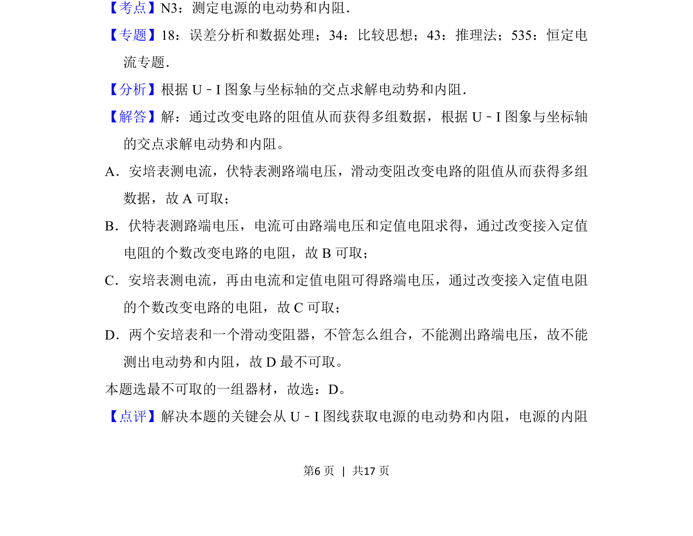

## 题面

## 摘要

探究测定电源电动势和内阻实验的器材组合选择，判断不可取的方案

## 关联考点

- [[786-测定电源的电动势和内阻|测定电源的电动势和内阻]]
- [[U-I图象法]]
- [[842-实验误差分析|实验误差分析]]

## 答案与解析

> 📄 原 PDF 第 6 页：`素材/真题/北京/2008-2024·（北京）物理高考真题/2016年高考物理试卷（北京）（解析卷）.pdf`
