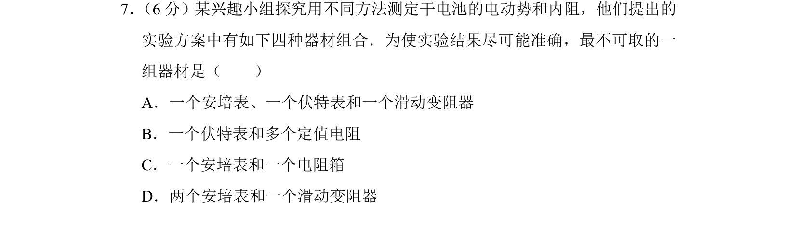
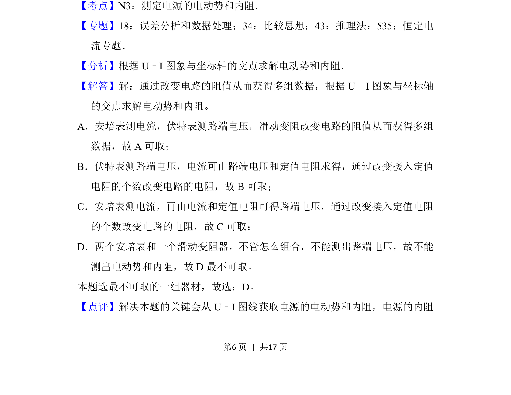

## 题面

## 摘要

探究测定电源电动势和内阻实验的器材组合选择，判断不可取的方案

## 关联考点

- [[786-测定电源的电动势和内阻|测定电源的电动势和内阻]]
- [[U-I图象法]]
- [[842-实验误差分析|实验误差分析]]

## 答案与解析

> 📄 原 PDF 第 6 页：`素材/真题/北京/2008-2024·（北京）物理高考真题/2016年高考物理试卷（北京）（解析卷）.pdf`

<!-- 题干文本-start -->
## 题干文本
7． （6分）某兴趣小组探究用不同方法测定干电池的电动势和内阻，他们提出的
实验方案中有如下四种器材组合．为使实验结果尽可能准确，最不可取的一
组器材是（　　）
A．一个安培表、一个伏特表和一个滑动变阻器
B．一个伏特表和多个定值电阻
C．一个安培表和一个电阻箱
D．两个安培表和一个滑动变阻器
<!-- 题干文本-end -->

<!-- 解析文本-start -->
## 解析文本
【考点】N3：测定电源的电动势和内阻．菁优网版权所有
【专题】18：误差分析和数据处理；34：比较思想；43：推理法；535：恒定电
流专题．
【分析】根据U﹣I图象与坐标轴的交点求解电动势和内阻．
【解答】解：通过改变电路的阻值从而获得多组数据，根据U﹣I图象与坐标轴
的交点求解电动势和内阻。
A．安培表测电流，伏特表测路端电压，滑动变阻改变电路的阻值从而获得多组
数据，故A可取；
B．伏特表测路端电压，电流可由路端电压和定值电阻求得，通过改变接入定值
电阻的个数改变电路的电阻，故B可取；
C．安培表测电流，再由电流和定值电阻可得路端电压，通过改变接入定值电阻
的个数改变电路的电阻，故C可取；
D．两个安培表和一个滑动变阻器，不管怎么组合，不能测出路端电压，故不能
测出电动势和内阻，故D最不可取。
本题选最不可取的一组器材，故选：D。
【点评】解决本题的关键会从U﹣I图线获取电源的电动势和内阻，电源的内阻
<!-- 解析文本-end -->
