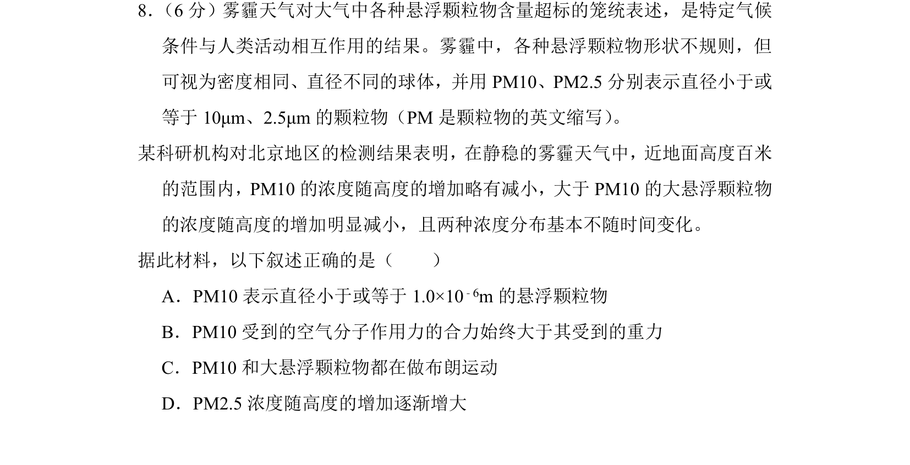
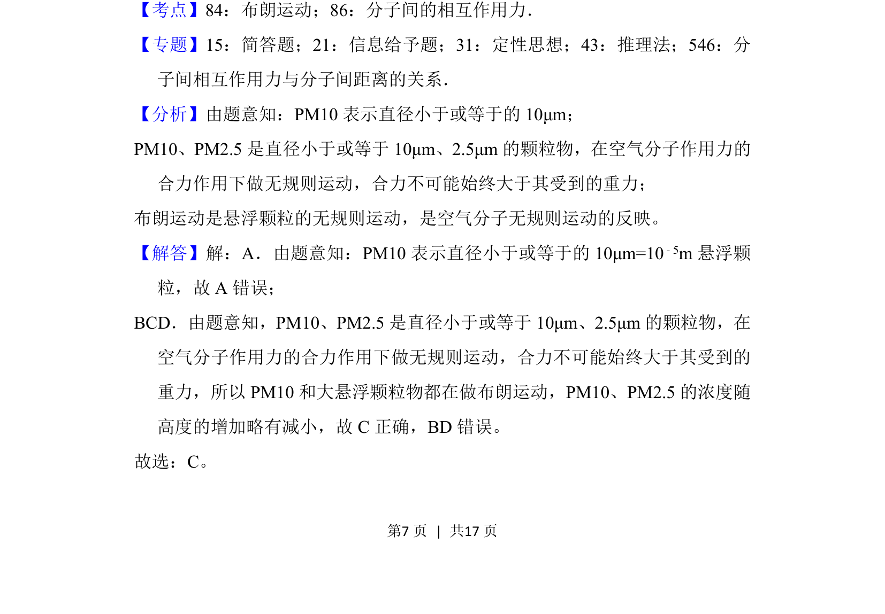
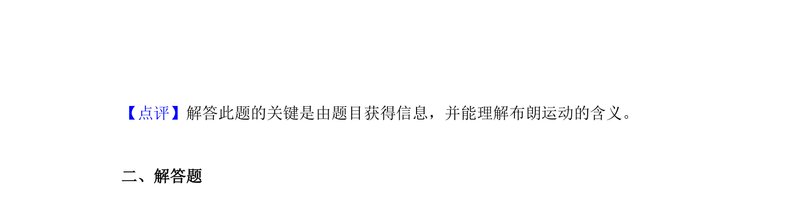

## 题面

## 摘要

通过雾霾颗粒物材料考查布朗运动、受力分析及单位换算

## 关联考点

- [[130-分子热运动|布朗运动]]
- [[841-分子间的相互作用力|分子间的相互作用力]]

## 答案与解析

> 📄 原 PDF 第 7 页：`素材/真题/北京/2008-2024·（北京）物理高考真题/2016年高考物理试卷（北京）（解析卷）.pdf`

<!-- 题干文本-start -->
## 题干文本
8． （6分）雾霾天气对大气中各种悬浮颗粒物含量超标的笼统表述，是特定气候
条件与人类活动相互作用的结果。雾霾中，各种悬浮颗粒物形状不规则，但
可视为密度相同、直径不同的球体，并用PM10、PM2.5分别表示直径小于或
等于10μm、2.5μm的颗粒物（PM是颗粒物的英文缩写） 。
某科研机构对北京地区的检测结果表明，在静稳的雾霾天气中，近地面高度百米
的范围内，PM10的浓度随高度的增加略有减小，大于PM10的大悬浮颗粒物
的浓度随高度的增加明显减小，且两种浓度分布基本不随时间变化。
据此材料，以下叙述正确的是（　　）
A．PM10表示直径小于或等于1.0×10 ﹣6m的悬浮颗粒物
B．PM10受到的空气分子作用力的合力始终大于其受到的重力
C．PM10和大悬浮颗粒物都在做布朗运动
D．PM2.5浓度随高度的增加逐渐增大
<!-- 题干文本-end -->

<!-- 解析文本-start -->
## 解析文本
【考点】84：布朗运动；86：分子间的相互作用力．菁优网版权所有
【专题】15：简答题；21：信息给予题；31：定性思想；43：推理法；546：分
子间相互作用力与分子间距离的关系．
【分析】由题意知：PM10表示直径小于或等于的10μm；
PM10、PM2.5是直径小于或等于10μm、2.5μm的颗粒物，在空气分子作用力的
合力作用下做无规则运动，合力不可能始终大于其受到的重力；
布朗运动是悬浮颗粒的无规则运动，是空气分子无规则运动的反映。
【解答】解：A．由题意知：PM10表示直径小于或等于的10μm=10 ﹣5m悬浮颗
粒，故A错误；
BCD．由题意知，PM10、PM2.5是直径小于或等于10μm、2.5μm的颗粒物，在
空气分子作用力的合力作用下做无规则运动，合力不可能始终大于其受到的
重力，所以PM10和大悬浮颗粒物都在做布朗运动，PM10、PM2.5的浓度随
高度的增加略有减小，故C正确，BD错误。
故选：C。
<!-- 解析文本-end -->
