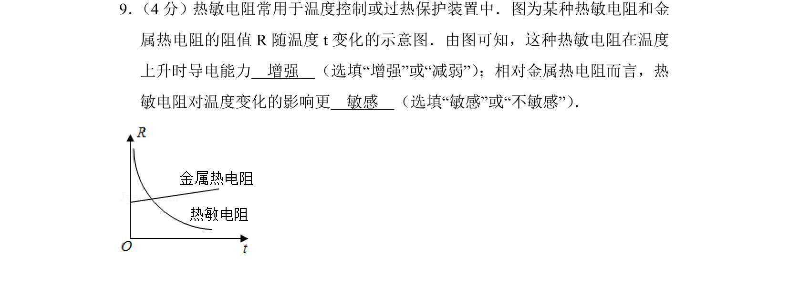
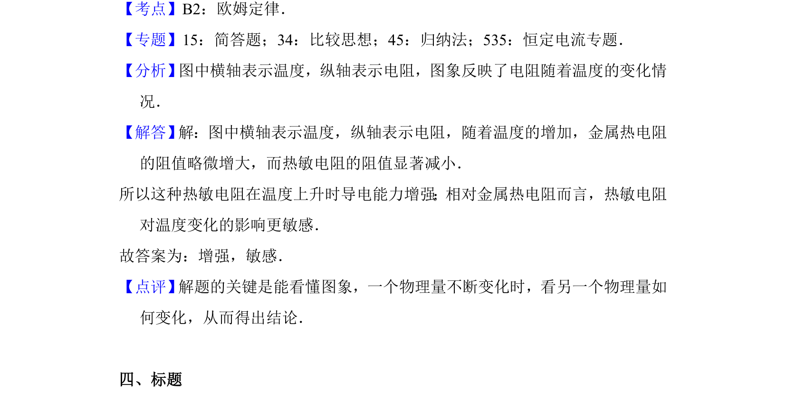

## 题面

## 摘要

通过 R-t 图像分析热敏电阻阻值随温度的变化，比较其与金属热电阻的导电能力及灵敏度差异。

## 关联考点

- [[热敏电阻]]
- [[电阻温度特性]]
- [[564-图像分析|图像分析]]

## 答案与解析

> 📄 原 PDF 第 8 页：`素材/真题/北京/2008-2024·（北京）物理高考真题/2016年高考物理试卷（北京）（解析卷）.pdf`
