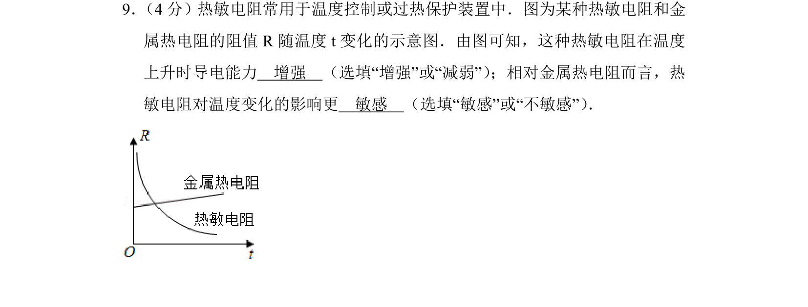
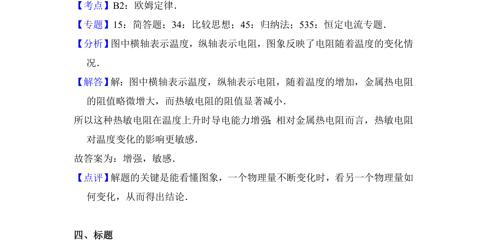

## 题面

## 摘要

通过 R-t 图像分析热敏电阻阻值随温度的变化，比较其与金属热电阻的导电能力及灵敏度差异。

## 关联考点

- [[热敏电阻]]
- [[电阻温度特性]]
- [[564-图像分析|图像分析]]

## 答案与解析

> 📄 原 PDF 第 8 页：`素材/真题/北京/2008-2024·（北京）物理高考真题/2016年高考物理试卷（北京）（解析卷）.pdf`

<!-- 题干文本-start -->
## 题干文本
9． （4分）热敏电阻常用于温度控制或过热保护装置中．图为某种热敏电阻和金
属热电阻的阻值R随温度t变化的示意图．由图可知，这种热敏电阻在温度
上升时导电能力　增强　（选填“增强”或“减弱”） ；相对金属热电阻而言，热
敏电阻对温度变化的影响更　敏感　（选填“敏感”或“不敏感”） ．
<!-- 题干文本-end -->

<!-- 解析文本-start -->
## 解析文本
【考点】B2：欧姆定律．菁优网版权所有
【专题】15：简答题；34：比较思想；45：归纳法；535：恒定电流专题．
【分析】 图中横轴表示温度，纵轴表示电阻，图象反映了电阻随着温度的变化情
况．
【解答】 解：图中横轴表示温度，纵轴表示电阻，随着温度的增加，金属热电阻
的阻值略微增大，而热敏电阻的阻值显著减小．
所以这种热敏电阻在温度上升时导电能力增强；相对金属热电阻而言，热敏电阻
对温度变化的影响更敏感．
故答案为：增强，敏感．
【点评】 解题的关键是能看懂图象，一个物理量不断变化时，看另一个物理量如
何变化，从而得出结论．
　
四、标题
<!-- 解析文本-end -->
