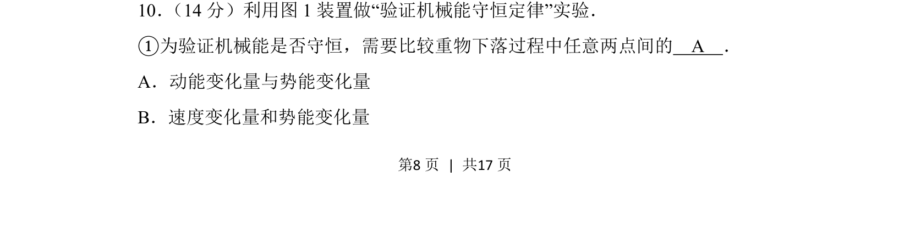
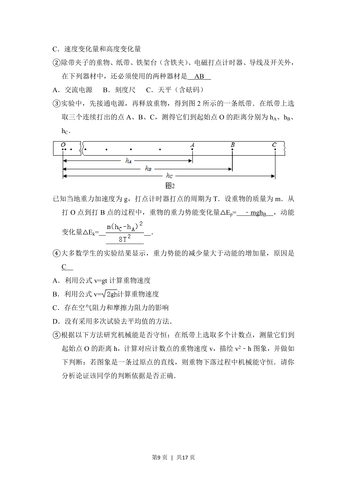
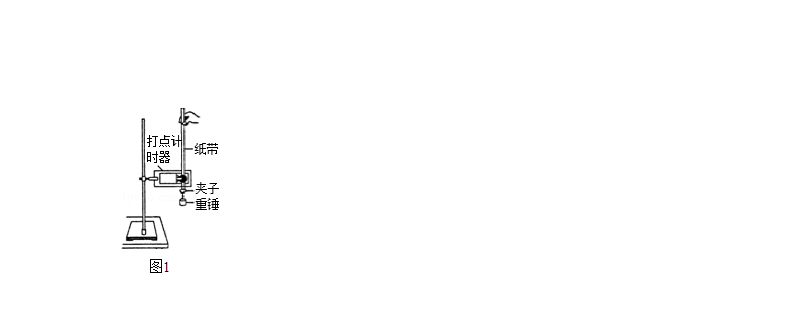
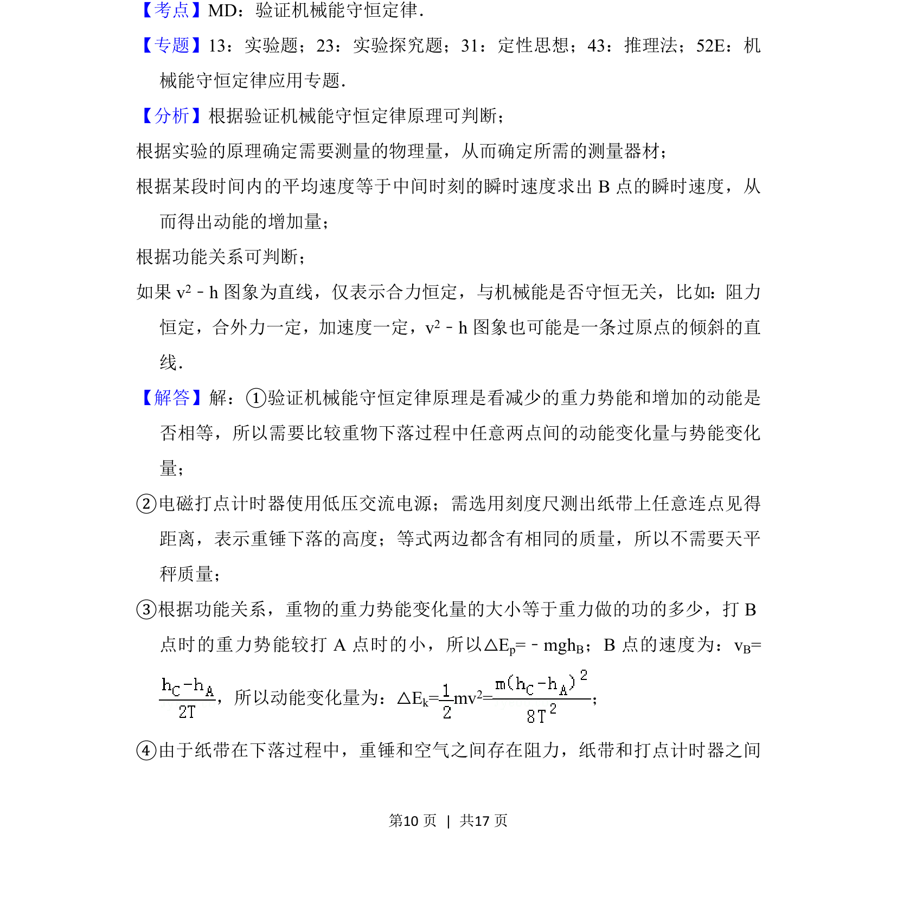
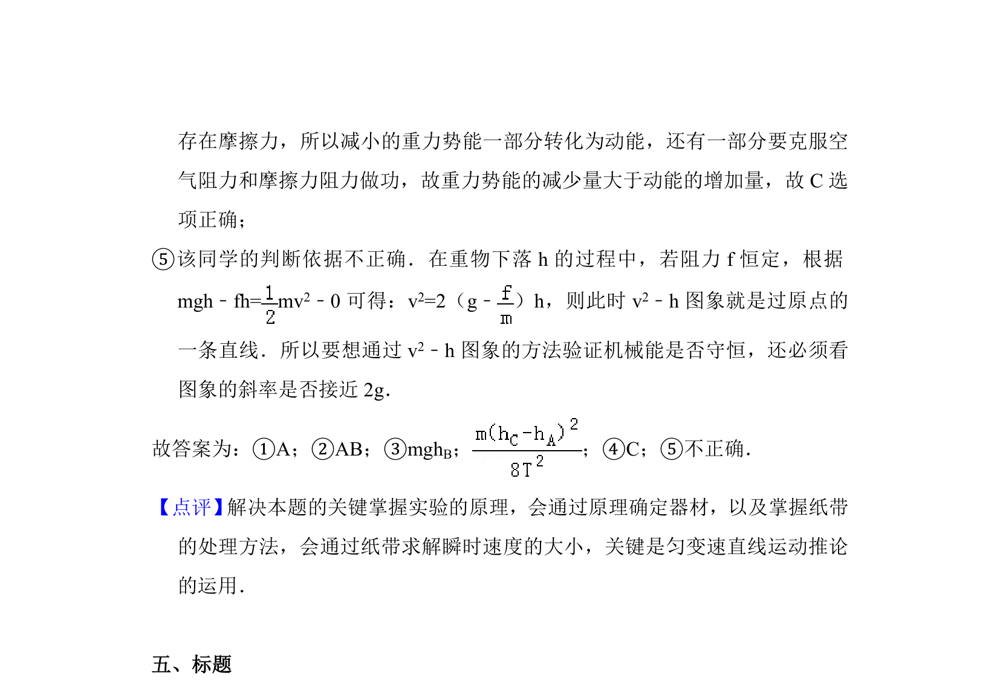

## 题面

## 摘要

利用实验装置验证机械能守恒定律，需比较重物下落过程中动能变化量与势能变化量

## 关联考点

- [[752-验证机械能守恒定律|验证机械能守恒定律]]
- [[动能变化量]]
- [[势能变化量]]

## 答案与解析

> 📄 原 PDF 第 8 页：`素材/真题/北京/2008-2024·（北京）物理高考真题/2016年高考物理试卷（北京）（解析卷）.pdf`
