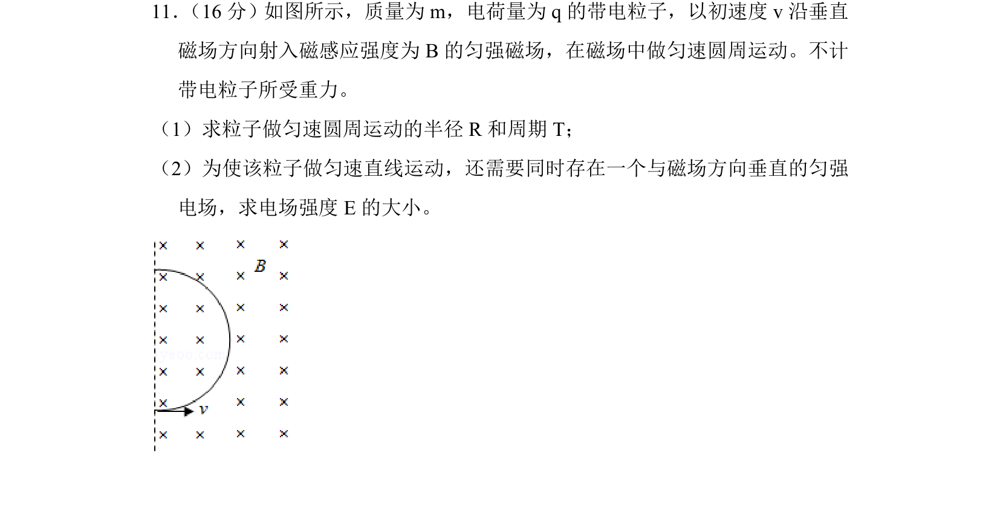
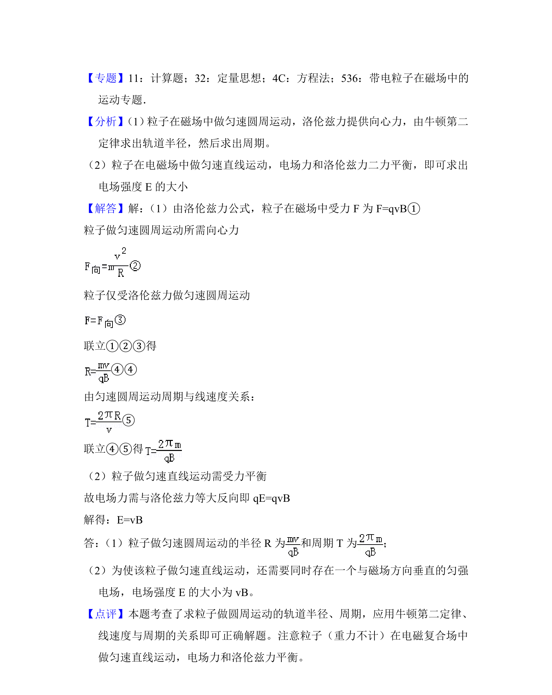

## 题面

## 摘要

粒子在磁场中做匀速圆周运动，求半径与周期；再加垂直电场使粒子做直线运动，求电场强度。

## 关联考点

- [[595-带电粒子在匀强磁场中的运动|带电粒子在匀强磁场中的运动]]
- [[468-带电粒子在匀强电场中的运动|带电粒子在匀强电场中的运动]]
- [[304-洛伦兹力|洛伦兹力]]
- [[253-匀速圆周运动|匀速圆周运动]]

## 答案与解析

> 📄 原 PDF 第 11 页：`素材/真题/北京/2008-2024·（北京）物理高考真题/2016年高考物理试卷（北京）（解析卷）.pdf`
