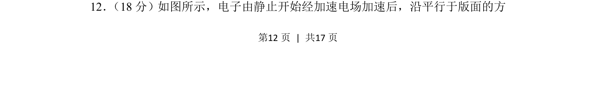
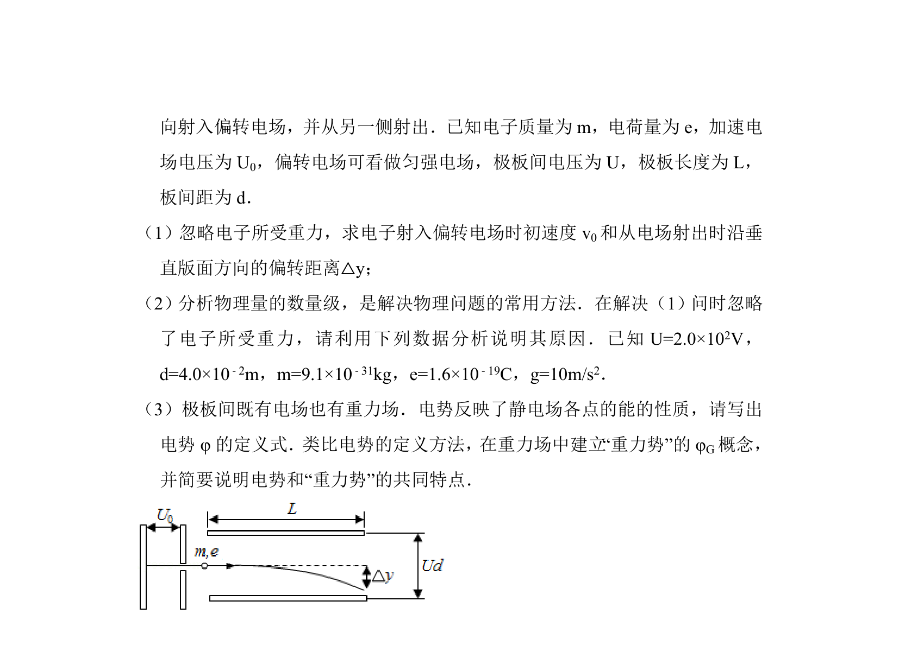
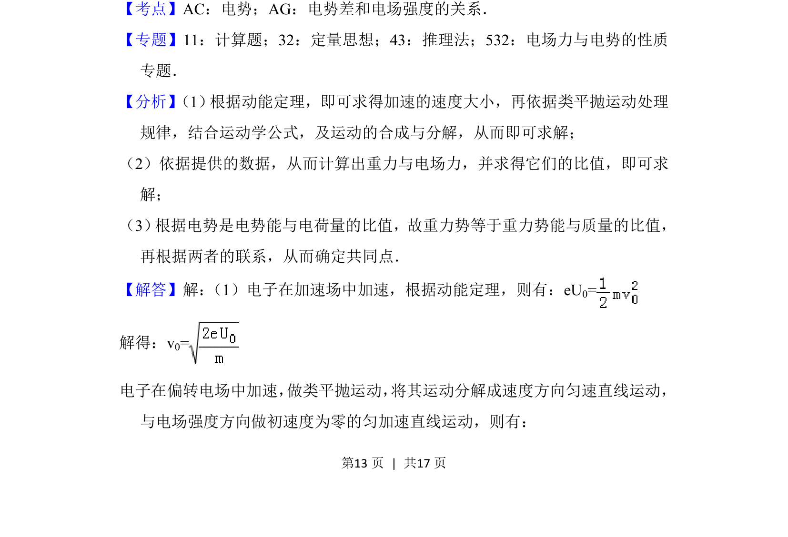
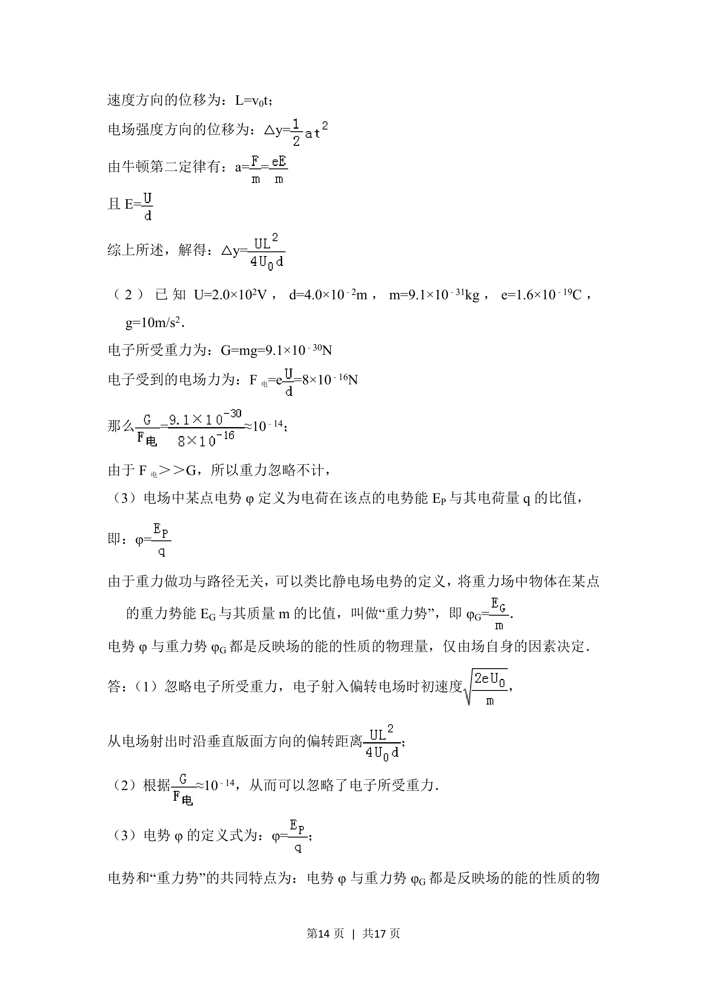
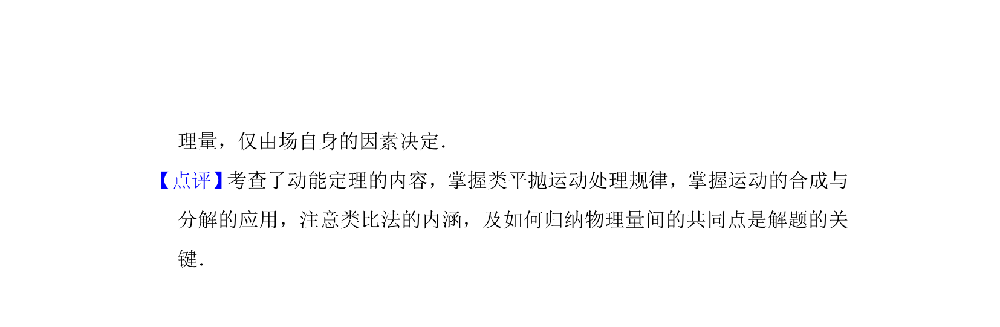

## 题面

## 摘要

电子经加速电场加速后进入偏转电场，考查带电粒子在电场中的运动规律及相关计算

## 关联考点

- [[带电粒子在电场中的加速]]
- [[带电粒子在匀强电场中的偏转]]
- [[251-动能定理|动能定理]]

## 答案与解析

> 📄 原 PDF 第 12 页：`素材/真题/北京/2008-2024·（北京）物理高考真题/2016年高考物理试卷（北京）（解析卷）.pdf`
