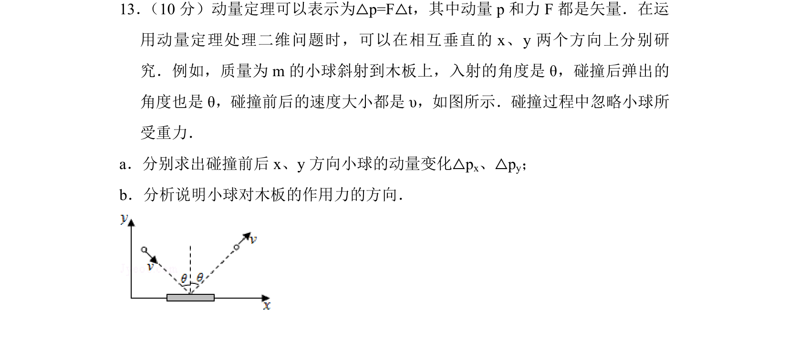
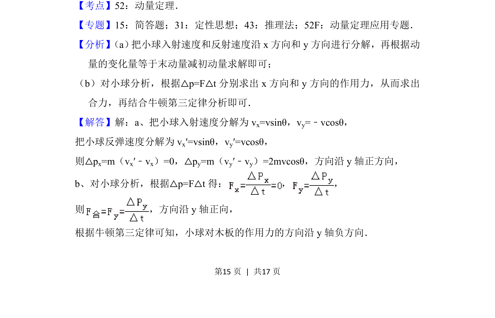
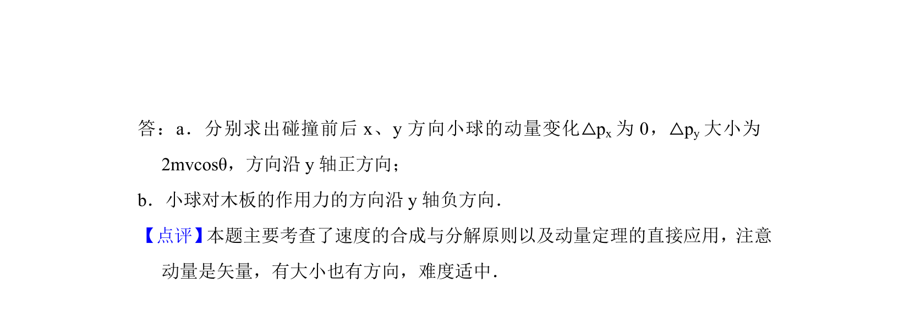

## 题面

## 摘要

a. 求斜射小球碰撞前后的动量变化；b. 分析小球对木板作用力方向。

## 关联考点

- [[349-动量定理|动量定理]]
- [[矢量分解]]
- [[228-牛顿第三定律|牛顿第三定律]]

## 答案与解析

> 📄 原 PDF 第 15 页：`素材/真题/北京/2008-2024·（北京）物理高考真题/2016年高考物理试卷（北京）（解析卷）.pdf`
