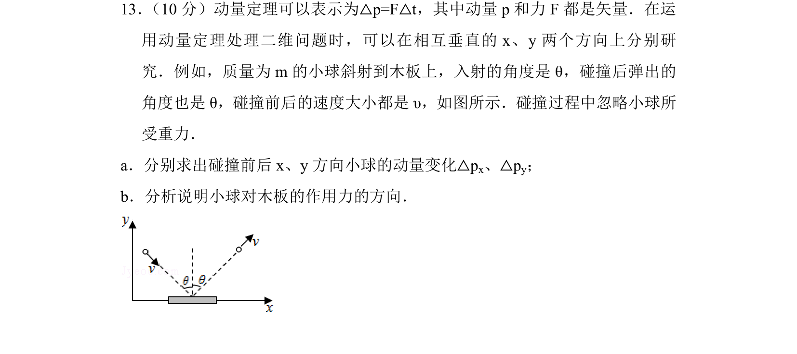
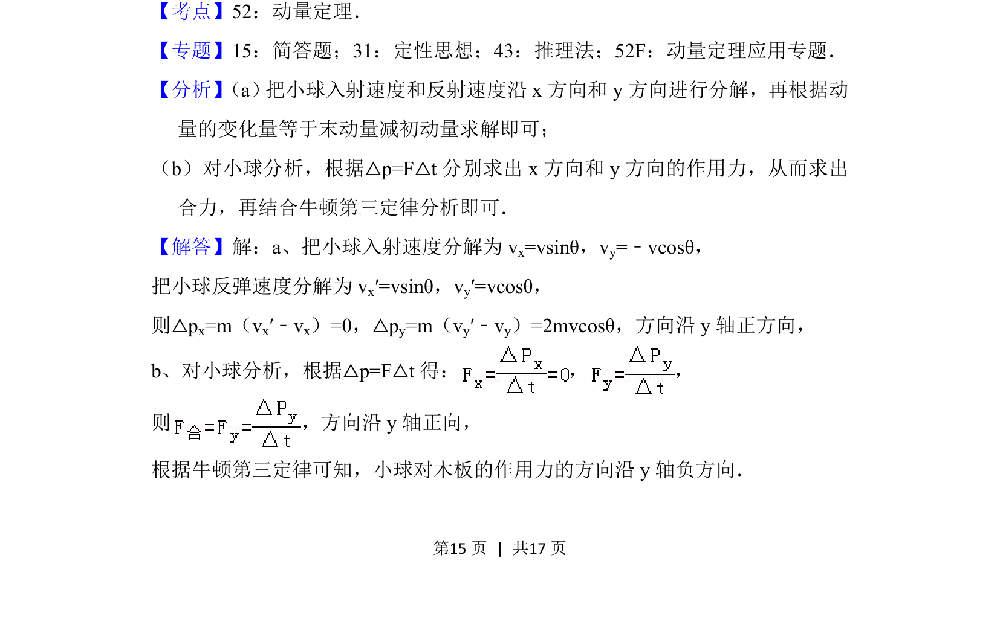
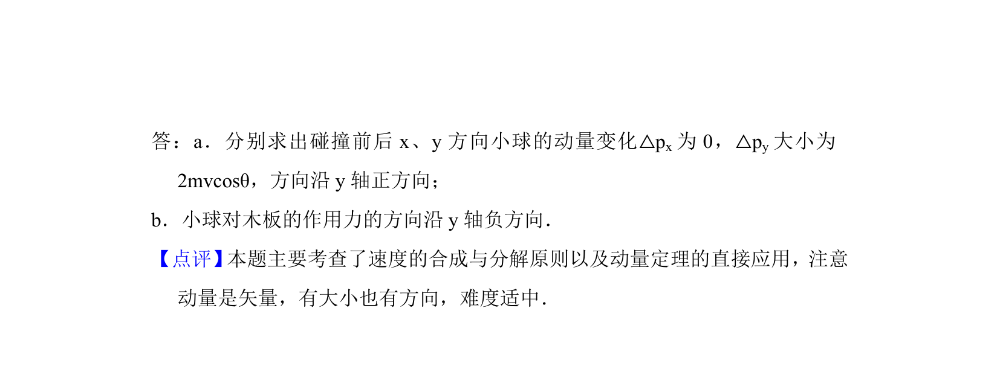

## 题面

## 摘要

a. 求斜射小球碰撞前后的动量变化；b. 分析小球对木板作用力方向。

## 关联考点

- [[349-动量定理|动量定理]]
- [[矢量分解]]
- [[228-牛顿第三定律|牛顿第三定律]]

## 答案与解析

> 📄 原 PDF 第 15 页：`素材/真题/北京/2008-2024·（北京）物理高考真题/2016年高考物理试卷（北京）（解析卷）.pdf`

<!-- 题干文本-start -->
## 题干文本
13． （10分）动量定理可以表示为△p=F△t，其中动量p和力F都是矢量．在运
用动量定理处理二维问题时，可以在相互垂直的x、y两个方向上分别研
究．例如，质量为m的小球斜射到木板上，入射的角度是θ，碰撞后弹出的
角度也是θ，碰撞前后的速度大小都是υ，如图所示．碰撞过程中忽略小球所
受重力．
a．分别求出碰撞前后x、y方向小球的动量变化△p x、△py；
b．分析说明小球对木板的作用力的方向．
<!-- 题干文本-end -->

<!-- 解析文本-start -->
## 解析文本
【考点】52：动量定理．菁优网版权所有
【专题】15：简答题；31：定性思想；43：推理法；52F：动量定理应用专题．
【分析】 （a） 把小球入射速度和反射速度沿x方向和y方向进行分解，再根据动
量的变化量等于末动量减初动量求解即可；
（b）对小球分析，根据△p=F△t分别求出x方向和y方向的作用力，从而求出
合力，再结合牛顿第三定律分析即可．
【解答】解：a、把小球入射速度分解为v x=vsinθ，vy=﹣vcosθ，
把小球反弹速度分解为v x′=vsinθ，vy′=vcosθ，
则△px=m（vx′﹣vx）=0，△py=m（vy′﹣vy）=2mvcosθ，方向沿y轴正方向，
b、对小球分析，根据△p=F△t得： ， ，
则 ，方向沿y轴正向，
根据牛顿第三定律可知，小球对木板的作用力的方向沿y轴负方向．
<!-- 解析文本-end -->
