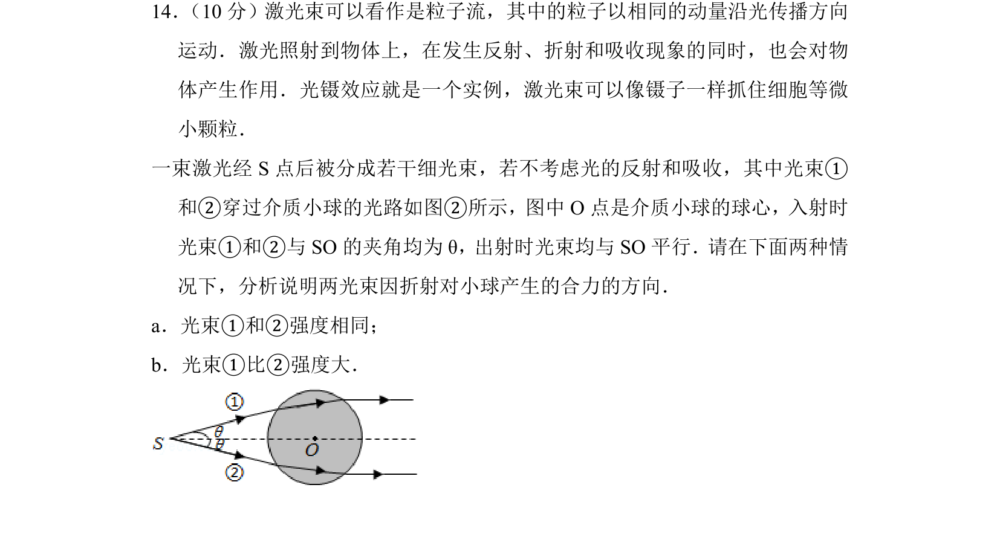
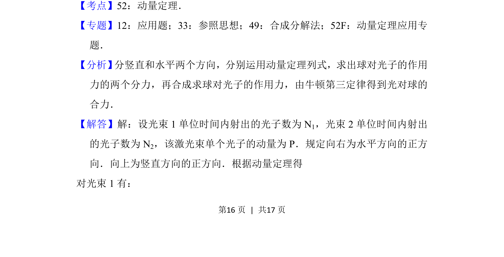
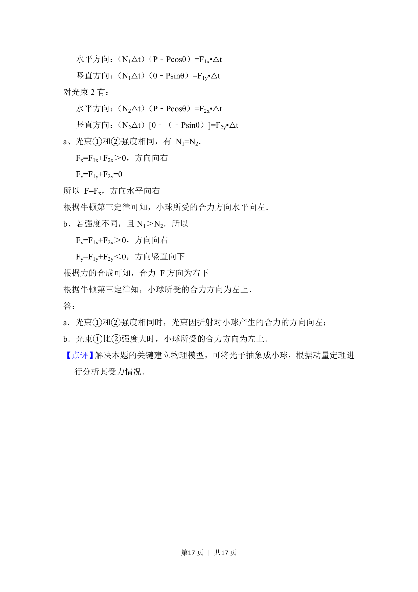

## 题面

## 摘要

一束激光经折射后对介质小球产生作用力，需用动量定理分方向分析两种强度条件下光束的合力方向。

## 关联考点

- [[349-动量定理|动量定理]]
- [[003-光的折射|光的折射]]
- [[701-矢量合成|矢量合成]]

## 答案与解析

> 📄 原 PDF 第 16 页：`素材/真题/北京/2008-2024·（北京）物理高考真题/2016年高考物理试卷（北京）（解析卷）.pdf`
