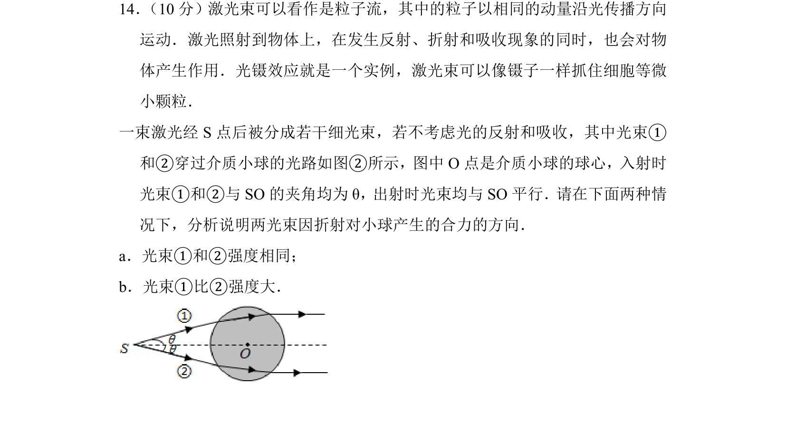
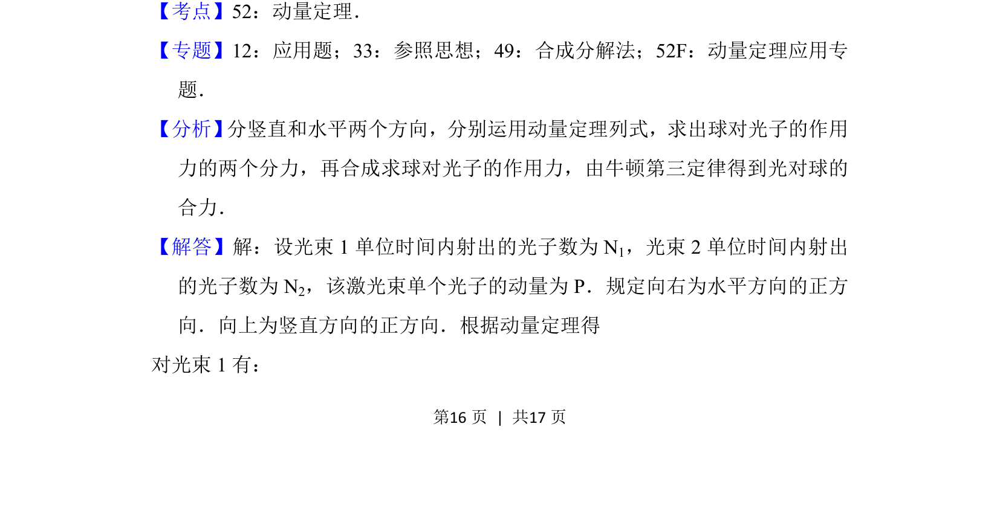
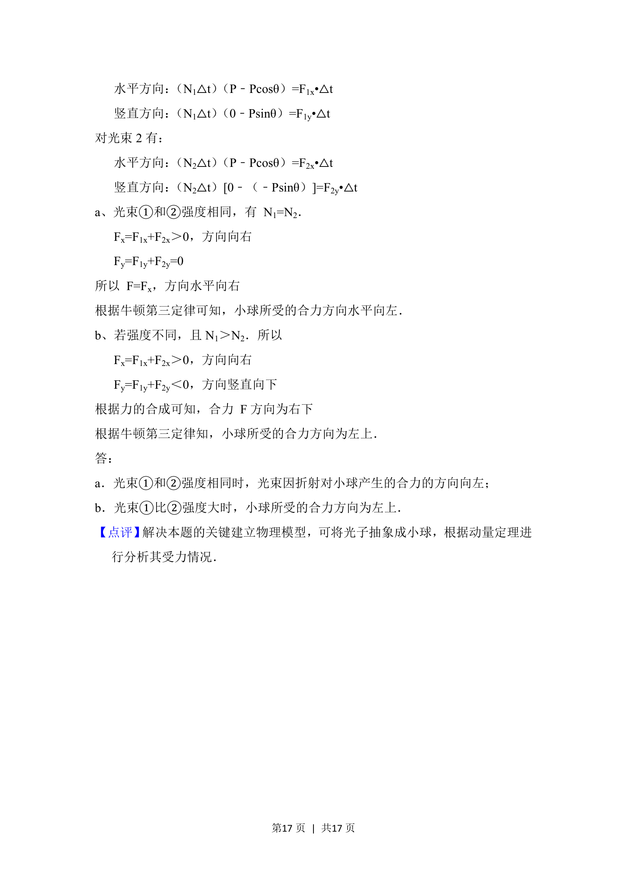

## 题面

## 摘要

一束激光经折射后对介质小球产生作用力，需用动量定理分方向分析两种强度条件下光束的合力方向。

## 关联考点

- [[349-动量定理|动量定理]]
- [[003-光的折射|光的折射]]
- [[701-矢量合成|矢量合成]]

## 答案与解析

> 📄 原 PDF 第 16 页：`素材/真题/北京/2008-2024·（北京）物理高考真题/2016年高考物理试卷（北京）（解析卷）.pdf`

<!-- 题干文本-start -->
## 题干文本
14． （10分）激光束可以看作是粒子流，其中的粒子以相同的动量沿光传播方向
运动．激光照射到物体上，在发生反射、折射和吸收现象的同时，也会对物
体产生作用．光镊效应就是一个实例，激光束可以像镊子一样抓住细胞等微
小颗粒．
一束激光经S点后被分成若干细光束，若不考虑光的反射和吸收，其中光束①
和②穿过介质小球的光路如图②所示，图中O点是介质小球的球心，入射时
光束①和②与SO的夹角均为θ，出射时光束均与SO平行．请在下面两种情
况下，分析说明两光束因折射对小球产生的合力的方向．
a．光束①和②强度相同；
b．光束①比②强度大．
<!-- 题干文本-end -->

<!-- 解析文本-start -->
## 解析文本
【考点】52：动量定理．菁优网版权所有
【专题】12：应用题；33：参照思想；49：合成分解法；52F：动量定理应用专
题．
【分析】 分竖直和水平两个方向，分别运用动量定理列式，求出球对光子的作用
力的两个分力，再合成求球对光子的作用力，由牛顿第三定律得到光对球的
合力．
【解答】解：设光束1单位时间内射出的光子数为N 1，光束2单位时间内射出
的光子数为N 2，该激光束单个光子的动量为P．规定向右为水平方向的正方
向．向上为竖直方向的正方向．根据动量定理得
对光束1有：
<!-- 解析文本-end -->
