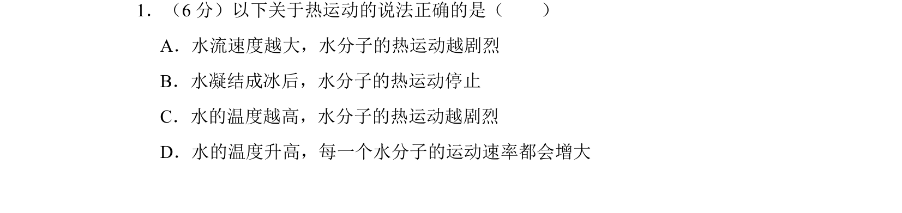
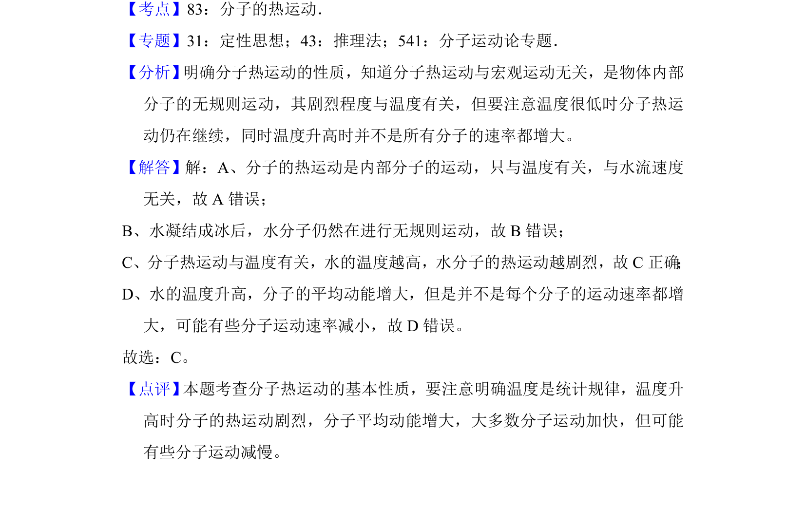

## 题面

## 摘要

分子热运动与温度有关而与宏观运动无关，温度升高平均动能增大但并非每个分子速率都增大。

## 关联考点

- [[840-分子的热运动|分子的热运动]]
- [[035-温度|温度]]
- [[839-分子平均动能|分子平均动能]]
- [[统计规律]]

## 答案与解析

> 📄 原 PDF 第 1 页：`素材/真题/北京/2008-2024·（北京）物理高考真题/2017年高考物理试卷（北京）（解析卷）.pdf`
