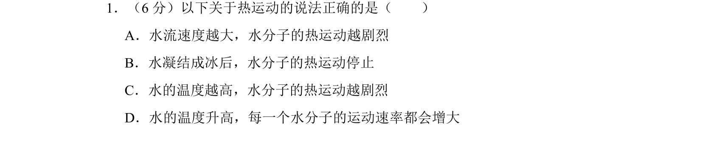
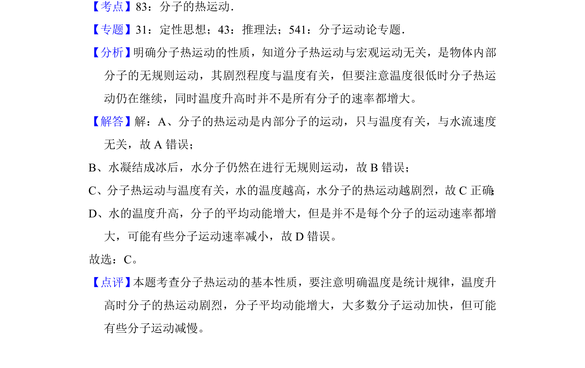

## 题面

## 摘要

分子热运动与温度有关而与宏观运动无关，温度升高平均动能增大但并非每个分子速率都增大。

## 关联考点

- [[130-分子热运动|分子的热运动]]
- [[035-温度|温度]]
- [[839-分子平均动能|分子平均动能]]
- [[统计规律]]

## 答案与解析

> 📄 原 PDF 第 1 页：`素材/真题/北京/2008-2024·（北京）物理高考真题/2017年高考物理试卷（北京）（解析卷）.pdf`

<!-- 题干文本-start -->
## 题干文本
1．（6分）以下关于热运动的说法正确的是（　　）
A．水流速度越大，水分子的热运动越剧烈
B．水凝结成冰后，水分子的热运动停止
C．水的温度越高，水分子的热运动越剧烈
D．水的温度升高，每一个水分子的运动速率都会增大
<!-- 题干文本-end -->

<!-- 解析文本-start -->
## 解析文本
【考点】83：分子的热运动．菁优网版权所有
【专题】31：定性思想；43：推理法；541：分子运动论专题．
【分析】 明确分子热运动的性质，知道分子热运动与宏观运动无关，是物体内部
分子的无规则运动，其剧烈程度与温度有关，但要注意温度很低时分子热运
动仍在继续，同时温度升高时并不是所有分子的速率都增大。
【解答】解：A、分子的热运动是内部分子的运动，只与温度有关，与水流速度
无关，故A错误；
B、水凝结成冰后，水分子仍然在进行无规则运动，故B错误；
C、分子热运动与温度有关，水的温度越高，水分子的热运动越剧烈，故C正确 ；
D、水的温度升高，分子的平均动能增大，但是并不是每个分子的运动速率都增
大，可能有些分子运动速率减小，故D错误。
故选：C。
【点评】 本题考查分子热运动的基本性质，要注意明确温度是统计规律，温度升
高时分子的热运动剧烈，分子平均动能增大，大多数分子运动加快，但可能
有些分子运动减慢。
<!-- 解析文本-end -->
