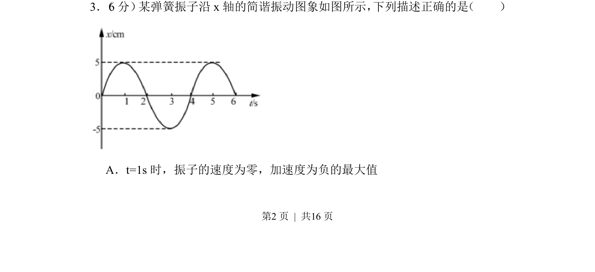
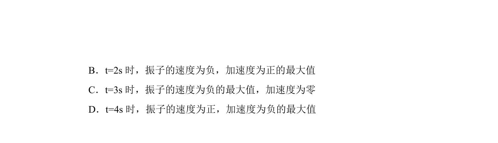
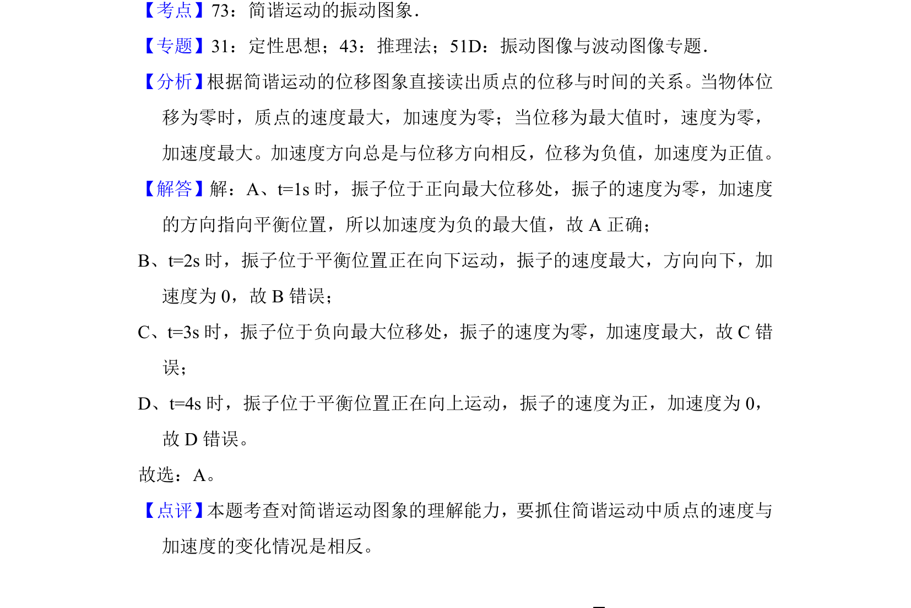

## 题面

## 摘要

考查根据简谐振动图像判断振子在特定时刻的速度与加速度方向及大小。

## 关联考点

- [[712-简谐振动|简谐振动]]
- [[857-振动图像|振动图像]]
- [[045-速度|速度]]
- [[214-加速度|加速度]]

## 答案与解析

> 📄 原 PDF 第 2 页：`素材/真题/北京/2008-2024·（北京）物理高考真题/2017年高考物理试卷（北京）（解析卷）.pdf`
