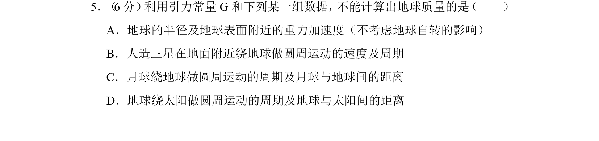
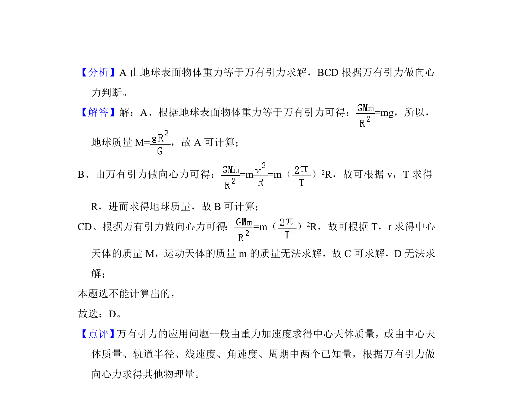

## 题面

## 摘要

考查利用万有引力定律计算中心天体质量的基本方法，辨析不同情境下能否求出地球质量。

## 关联考点

- [[834-万有引力定律及其应用|万有引力定律及其应用]]
- [[中心天体质量计算]]
- [[环绕天体运动]]

## 答案与解析

> 📄 原 PDF 第 4 页：`素材/真题/北京/2008-2024·（北京）物理高考真题/2017年高考物理试卷（北京）（解析卷）.pdf`
