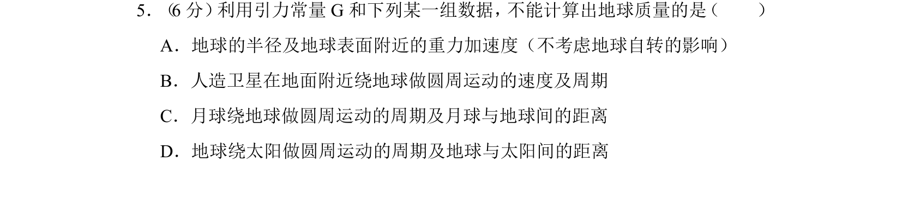
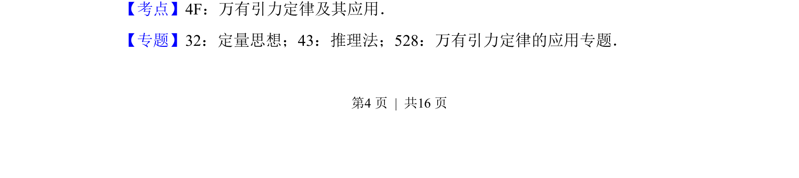
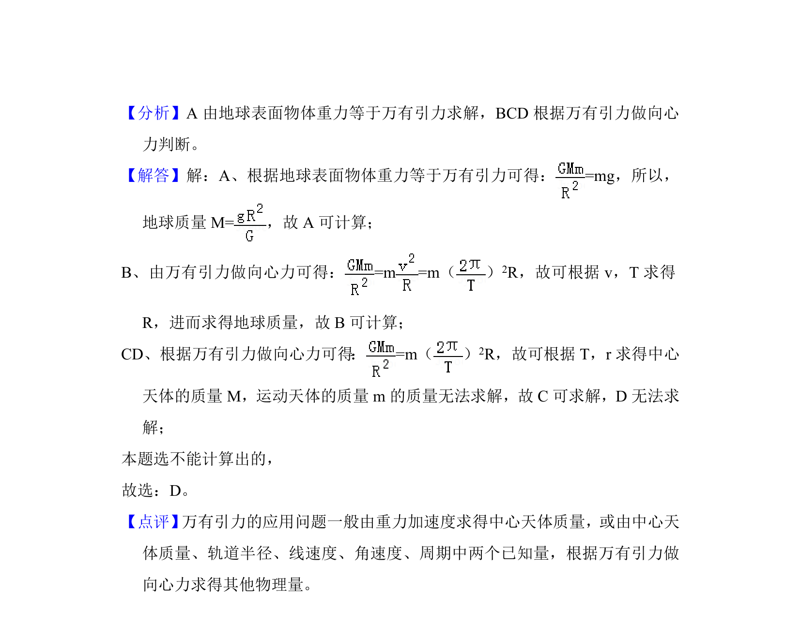

## 题面

## 摘要

考查利用万有引力定律计算中心天体质量的基本方法，辨析不同情境下能否求出地球质量。

## 关联考点

- [[834-万有引力定律及其应用|万有引力定律及其应用]]
- [[中心天体质量计算]]
- [[环绕天体运动]]

## 答案与解析

> 📄 原 PDF 第 4 页：`素材/真题/北京/2008-2024·（北京）物理高考真题/2017年高考物理试卷（北京）（解析卷）.pdf`

<!-- 题干文本-start -->
## 题干文本
5． （6分） 利用引力常量G和下列某一组数据， 不能计算出地球质量的是 （　　）
A．地球的半径及地球表面附近的重力加速度（不考虑地球自转的影响）
B．人造卫星在地面附近绕地球做圆周运动的速度及周期
C．月球绕地球做圆周运动的周期及月球与地球间的距离
D．地球绕太阳做圆周运动的周期及地球与太阳间的距离
<!-- 题干文本-end -->

<!-- 解析文本-start -->
## 解析文本
【考点】4F：万有引力定律及其应用．菁优网版权所有
【专题】32：定量思想；43：推理法；528：万有引力定律的应用专题．
<!-- 解析文本-end -->
