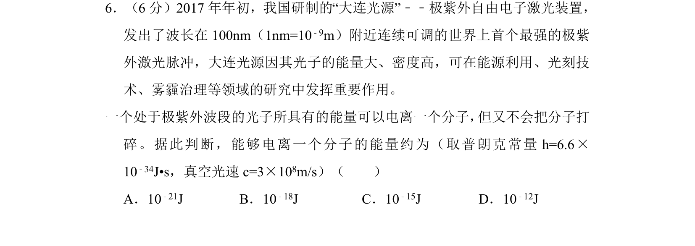
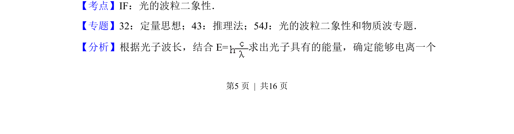
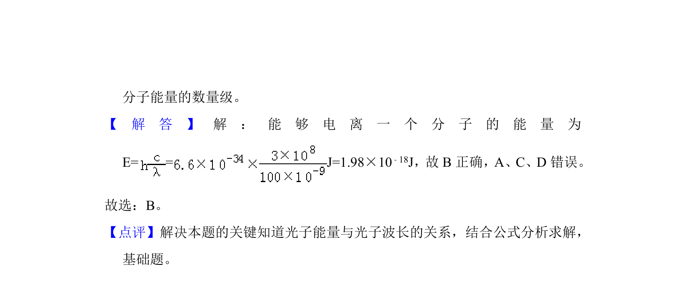

## 题面

## 摘要

根据极紫外光子波长计算光子能量，判断其电离分子的大致能量数量级。

## 关联考点

- [[418-光的波粒二象性|光的波粒二象性]]
- [[453-光子能量|光子能量]]
- [[479-波长与频率关系|波长与频率关系]]

## 答案与解析

> 📄 原 PDF 第 5 页：`素材/真题/北京/2008-2024·（北京）物理高考真题/2017年高考物理试卷（北京）（解析卷）.pdf`
