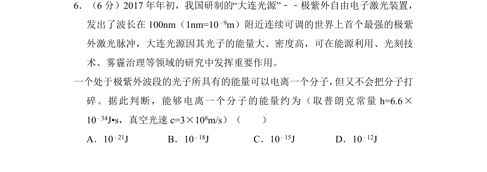
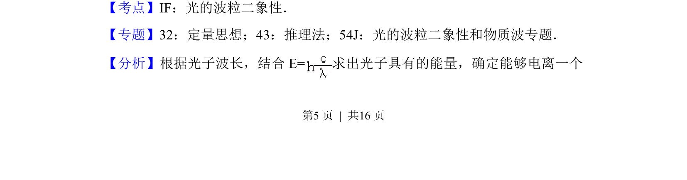
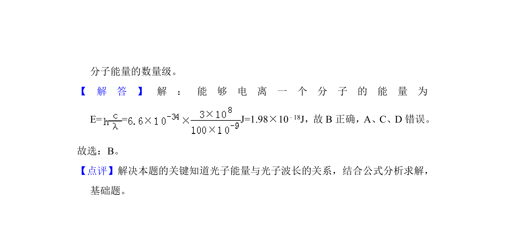

## 题面

## 摘要

根据极紫外光子波长计算光子能量，判断其电离分子的大致能量数量级。

## 关联考点

- [[418-光的波粒二象性|光的波粒二象性]]
- [[453-光子能量|光子能量]]
- [[479-波长与频率关系|波长与频率关系]]

## 答案与解析

> 📄 原 PDF 第 5 页：`素材/真题/北京/2008-2024·（北京）物理高考真题/2017年高考物理试卷（北京）（解析卷）.pdf`

<!-- 题干文本-start -->
## 题干文本
6．（6分）2017年年初，我国研制的“大连光源”﹣﹣极紫外自由电子激光装置，
发出了波长在100nm（1nm=10 ﹣9m）附近连续可调的世界上首个最强的极紫
外激光脉冲，大连光源因其光子的能量大、密度高，可在能源利用、光刻技
术、雾霾治理等领域的研究中发挥重要作用。
一个处于极紫外波段的光子所具有的能量可以电离一个分子， 但又不会把分子打
碎。据此判断，能够电离一个分子的能量约为（取普朗克常量h=6.6×
10﹣34J•s，真空光速c=3×10 8m/s）（　　）
A．10﹣21J B．10 ﹣18J C．10 ﹣15J D．10 ﹣12J
<!-- 题干文本-end -->

<!-- 解析文本-start -->
## 解析文本
【考点】IF：光的波粒二象性．菁优网版权所有
【专题】32：定量思想；43：推理法；54J：光的波粒二象性和物质波专题．
【分析】根据光子波长，结合E=求出光子具有的能量，确定能够电离一个
<!-- 解析文本-end -->
