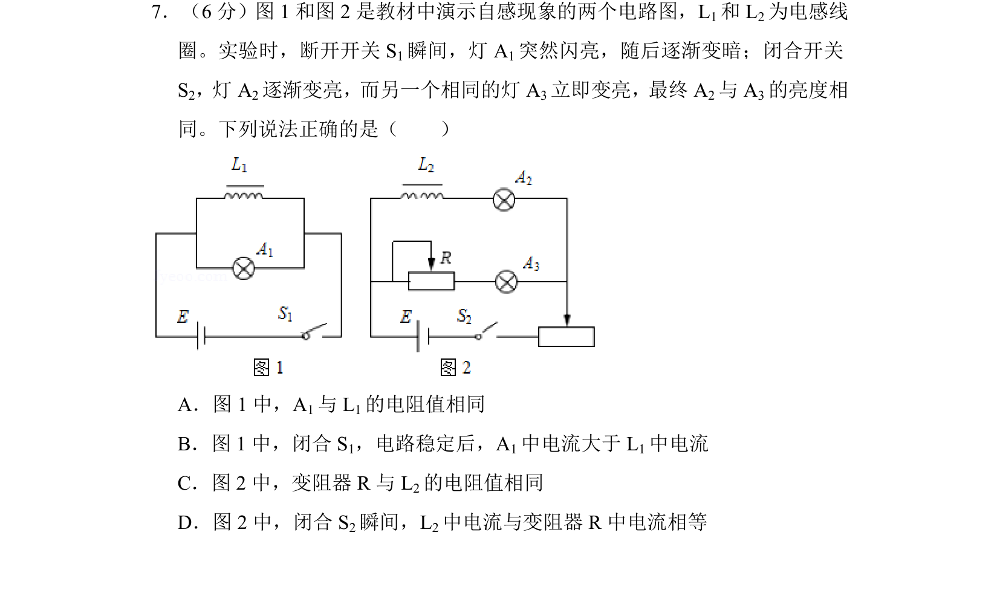
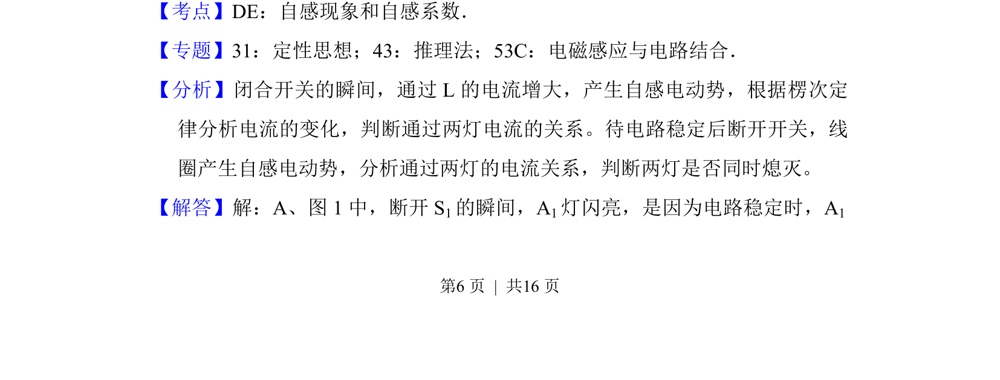
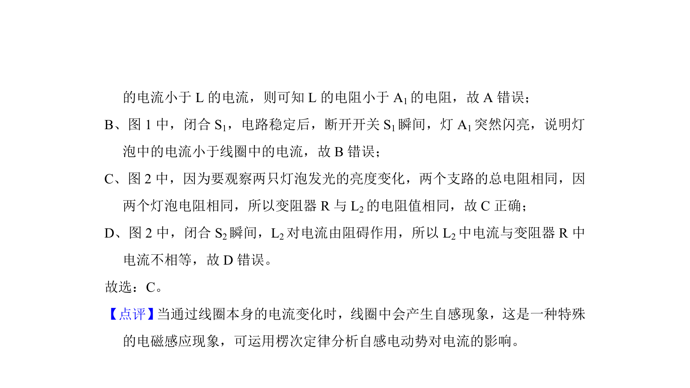

## 题面

## 摘要

该题通过两个自感电路实验，分析电感线圈对电流变化的阻碍作用，判断元件电阻关系及电流大小。

## 关联考点

- [[853-自感现象|自感现象]]
- [[412-自感系数|自感系数]]
- [[电路动态分析]]

## 答案与解析

> 📄 原 PDF 第 6 页：`素材/真题/北京/2008-2024·（北京）物理高考真题/2017年高考物理试卷（北京）（解析卷）.pdf`
