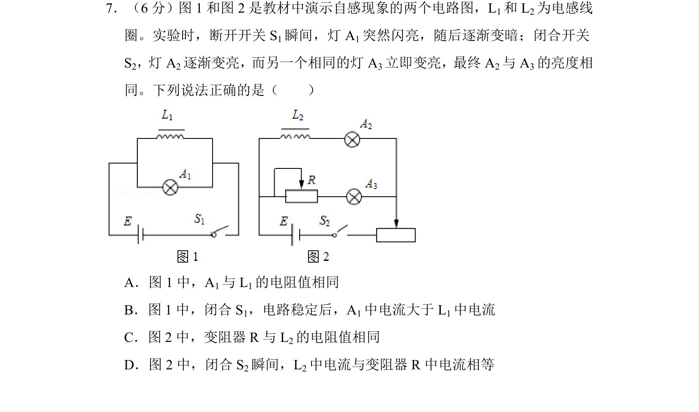
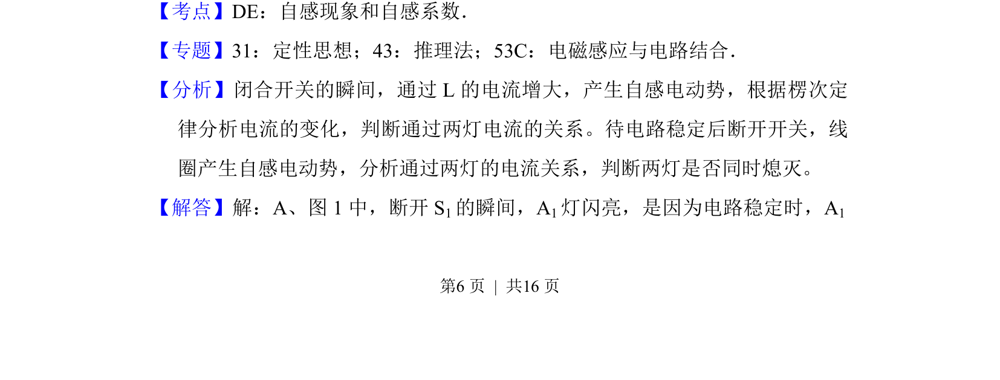
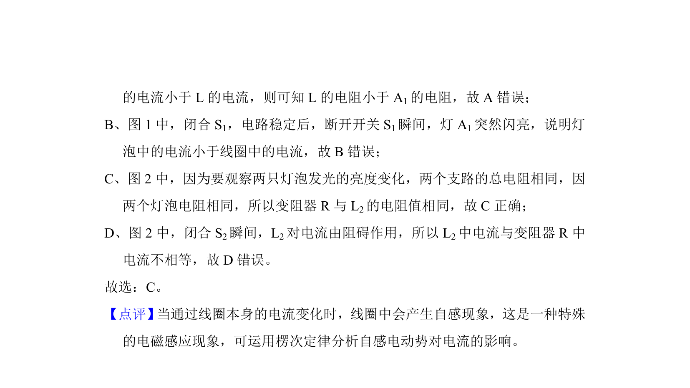

## 题面

## 摘要

该题通过两个自感电路实验，分析电感线圈对电流变化的阻碍作用，判断元件电阻关系及电流大小。

## 关联考点

- [[853-自感现象|自感现象]]
- [[412-自感系数|自感系数]]
- [[电路动态分析]]

## 答案与解析

> 📄 原 PDF 第 6 页：`素材/真题/北京/2008-2024·（北京）物理高考真题/2017年高考物理试卷（北京）（解析卷）.pdf`

<!-- 题干文本-start -->
## 题干文本
7．（6分）图1和图2是教材中演示自感现象的两个电路图，L 1和L 2为电感线
圈。实验时，断开开关S 1瞬间，灯A 1突然闪亮，随后逐渐变暗；闭合开关
S2，灯A 2逐渐变亮，而另一个相同的灯A 3立即变亮，最终A 2与A 3的亮度相
同。下列说法正确的是（　　）
A．图1中，A 1与L 1的电阻值相同
B．图1中，闭合S 1，电路稳定后，A1中电流大于L 1中电流
C．图2中，变阻器R与L 2的电阻值相同
D．图2中，闭合S 2瞬间，L2中电流与变阻器R中电流相等
<!-- 题干文本-end -->

<!-- 解析文本-start -->
## 解析文本
【考点】DE：自感现象和自感系数．菁优网版权所有
【专题】31：定性思想；43：推理法；53C：电磁感应与电路结合．
【分析】闭合开关的瞬间，通过L的电流增大，产生自感电动势，根据楞次定
律分析电流的变化，判断通过两灯电流的关系。待电路稳定后断开开关，线
圈产生自感电动势，分析通过两灯的电流关系，判断两灯是否同时熄灭。
【解答】解：A、图1中，断开S 1的瞬间，A1灯闪亮，是因为电路稳定时，A1
<!-- 解析文本-end -->
