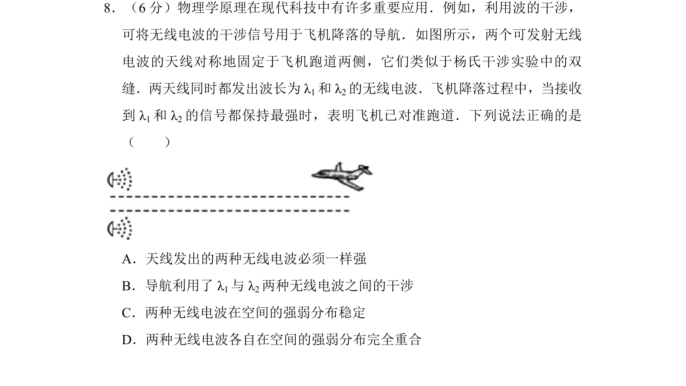
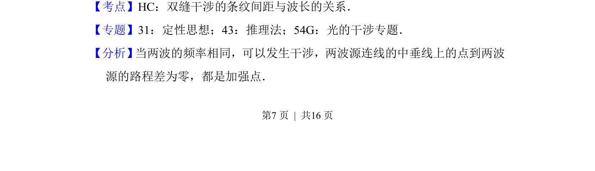
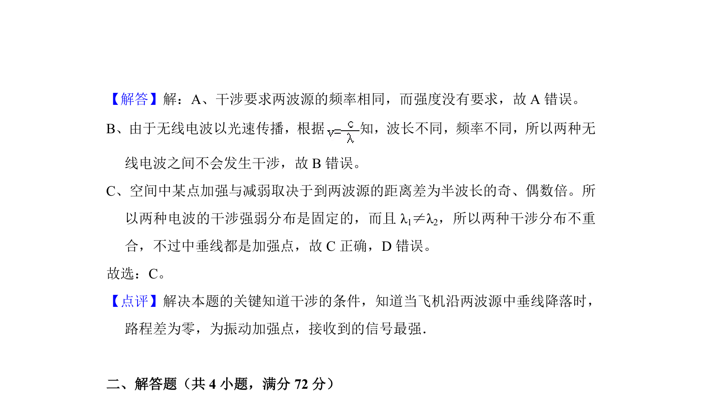

## 题面

## 摘要

本题考查波的干涉在飞机导航中的应用，需理解干涉条件与加强点的位置关系。

## 关联考点

- [[366-波的干涉|波的干涉]]
- [[552-双缝干涉|双缝干涉]]
- [[370-波长|波长]]
- [[频率相同]]

## 答案与解析

> 📄 原 PDF 第 7 页：`素材/真题/北京/2008-2024·（北京）物理高考真题/2017年高考物理试卷（北京）（解析卷）.pdf`
