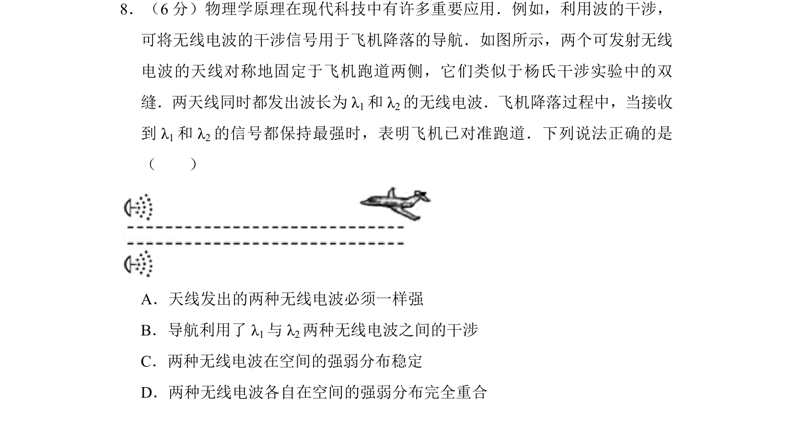
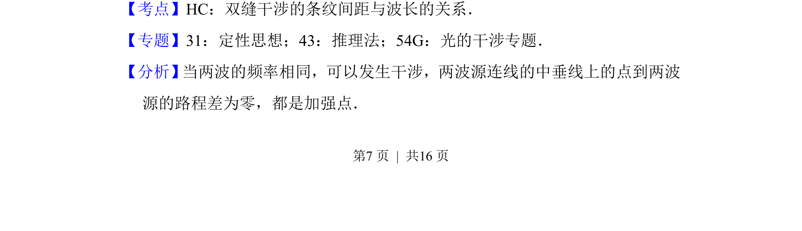
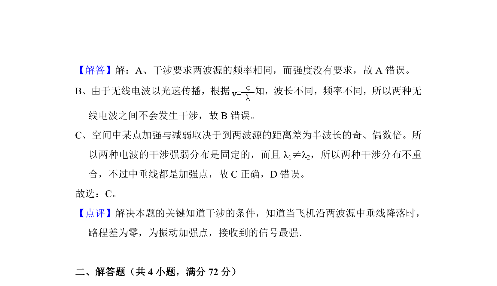

## 题面

## 摘要

本题考查波的干涉在飞机导航中的应用，需理解干涉条件与加强点的位置关系。

## 关联考点

- [[366-波的干涉|波的干涉]]
- [[552-双缝干涉|双缝干涉]]
- [[370-波长|波长]]
- [[频率相同]]

## 答案与解析

> 📄 原 PDF 第 7 页：`素材/真题/北京/2008-2024·（北京）物理高考真题/2017年高考物理试卷（北京）（解析卷）.pdf`

<!-- 题干文本-start -->
## 题干文本
8．（6分）物理学原理在现代科技中有许多重要应用．例如，利用波的干涉，
可将无线电波的干涉信号用于飞机降落的导航．如图所示，两个可发射无线
电波的天线对称地固定于飞机跑道两侧，它们类似于杨氏干涉实验中的双
缝．两天线同时都发出波长为λ 1和λ 2的无线电波．飞机降落过程中，当接收
到λ 1和λ 2的信号都保持最强时，表明飞机已对准跑道．下列说法正确的是
（　　）
A．天线发出的两种无线电波必须一样强
B．导航利用了λ 1与λ 2两种无线电波之间的干涉
C．两种无线电波在空间的强弱分布稳定
D．两种无线电波各自在空间的强弱分布完全重合
<!-- 题干文本-end -->

<!-- 解析文本-start -->
## 解析文本
【考点】HC：双缝干涉的条纹间距与波长的关系．菁优网版权所有
【专题】31：定性思想；43：推理法；54G：光的干涉专题．
【分析】 当两波的频率相同，可以发生干涉，两波源连线的中垂线上的点到两波
源的路程差为零，都是加强点．
<!-- 解析文本-end -->
