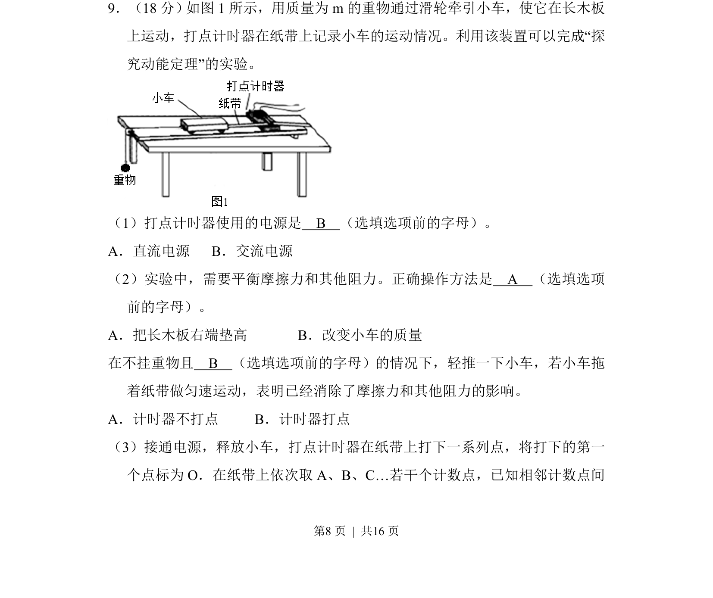
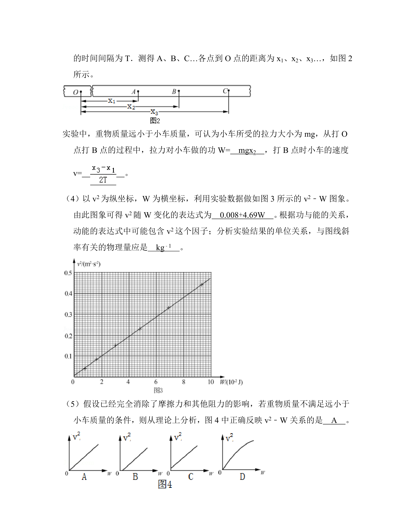
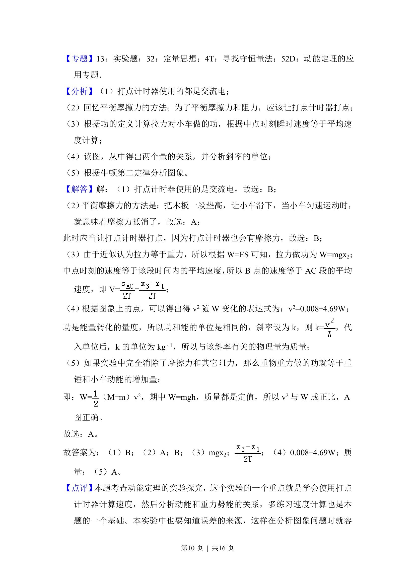

## 题面

## 摘要

该题考查探究动能定理实验中的基本操作，包括打点计时器电源选择和平衡摩擦力方法。

## 关联考点

- [[探究动能定理]]
- [[755-打点计时器|打点计时器]]
- [[856-平衡摩擦力|平衡摩擦力]]

## 答案与解析

> 📄 原 PDF 第 8 页：`素材/真题/北京/2008-2024·（北京）物理高考真题/2017年高考物理试卷（北京）（解析卷）.pdf`
