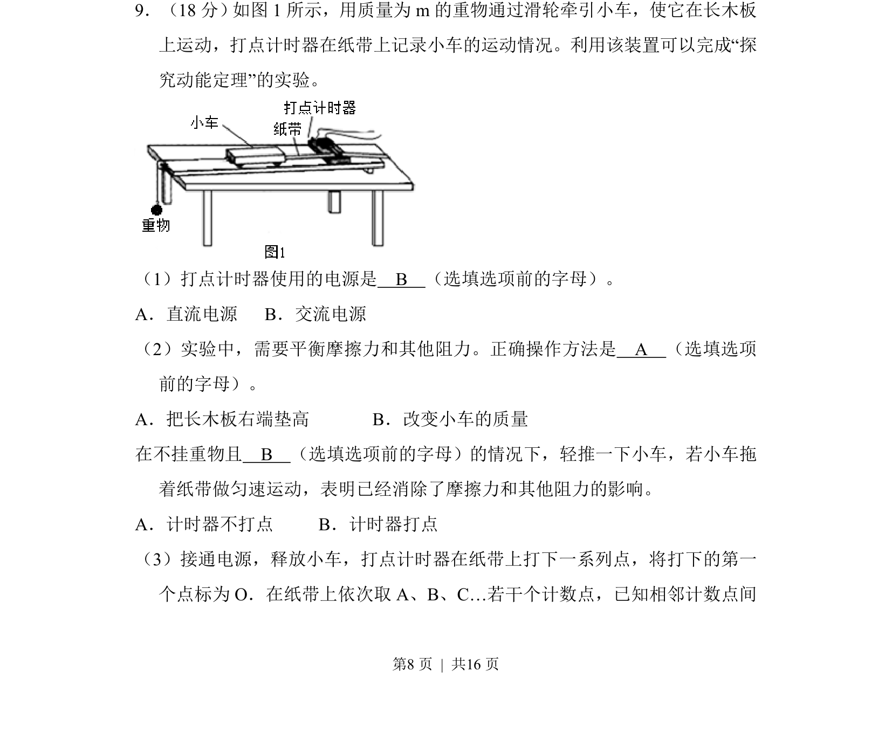
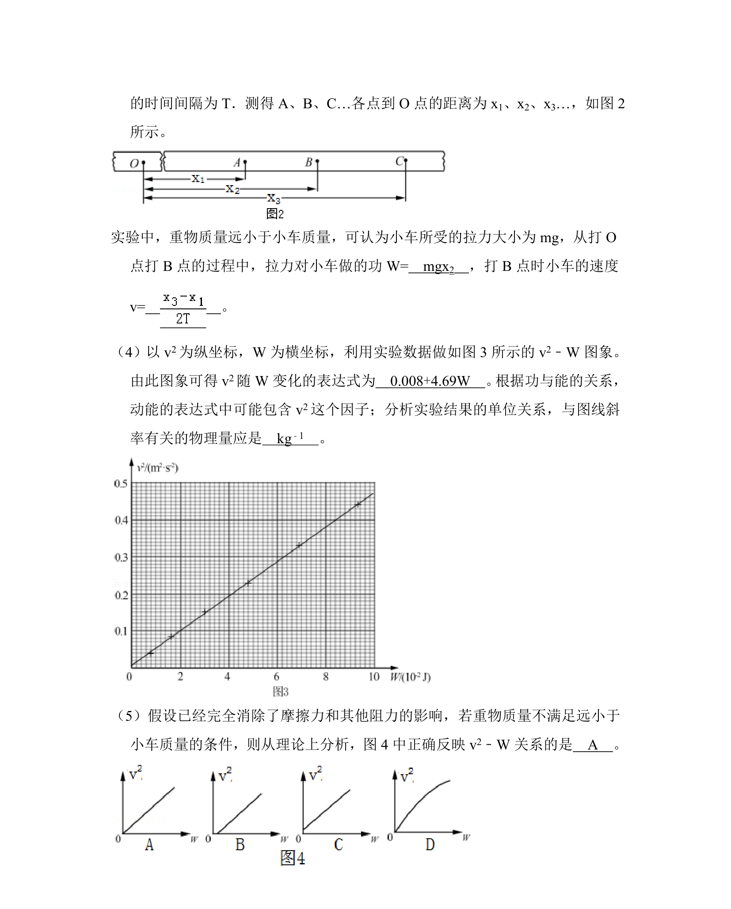
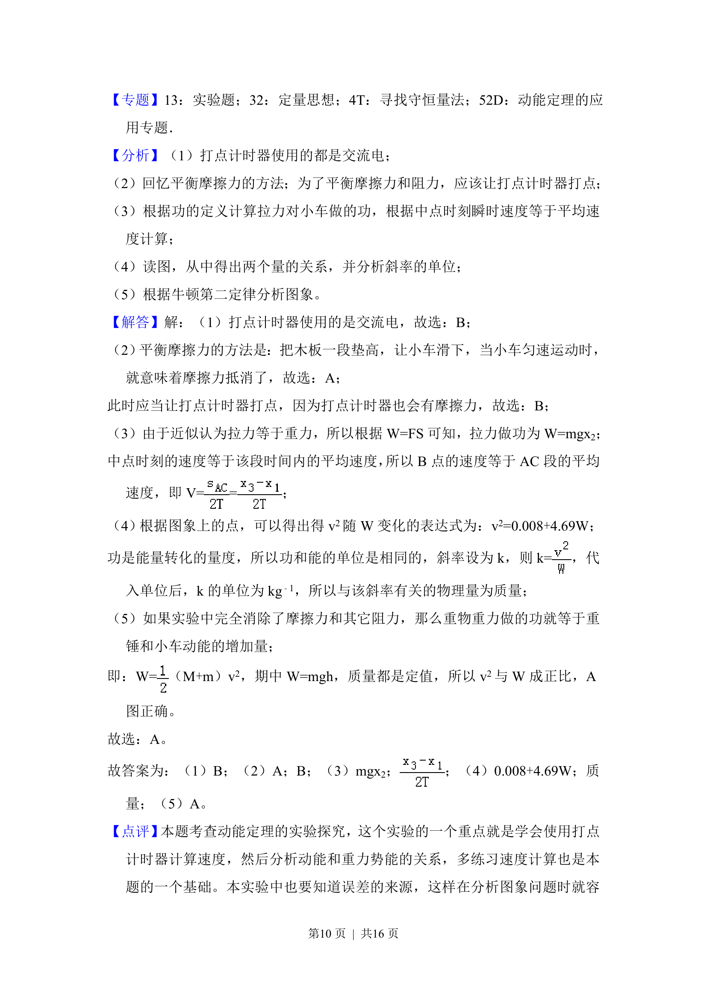

## 题面

## 摘要

该题考查探究动能定理实验中的基本操作，包括打点计时器电源选择和平衡摩擦力方法。

## 关联考点

- [[探究动能定理]]
- [[755-打点计时器|打点计时器]]
- [[856-平衡摩擦力|平衡摩擦力]]

## 答案与解析

> 📄 原 PDF 第 8 页：`素材/真题/北京/2008-2024·（北京）物理高考真题/2017年高考物理试卷（北京）（解析卷）.pdf`

<!-- 题干文本-start -->
## 题干文本
9．（18分） 如图1所示，用质量为m的重物通过滑轮牵引小车，使它在长木板
上运动，打点计时器在纸带上记录小车的运动情况。利用该装置可以完成“探
究动能定理”的实验。
（1）打点计时器使用的电源是　B　（选填选项前的字母）。
A．直流电源   B．交流电源
（2）实验中，需要平衡摩擦力和其他阻力。正确操作方法是　A　（选填选项
前的字母）。
A．把长木板右端垫高       B．改变小车的质量
在不挂重物且　B　（选填选项前的字母）的情况下，轻推一下小车，若小车拖
着纸带做匀速运动，表明已经消除了摩擦力和其他阻力的影响。
A．计时器不打点     B．计时器打点
（3）接通电源，释放小车，打点计时器在纸带上打下一系列点，将打下的第一
个点标为O．在纸带上依次取A、B、C…若干个计数点，已知相邻计数点间
<!-- 题干文本-end -->

<!-- 解析文本-start -->
## 解析文本

<!-- 解析文本-end -->
