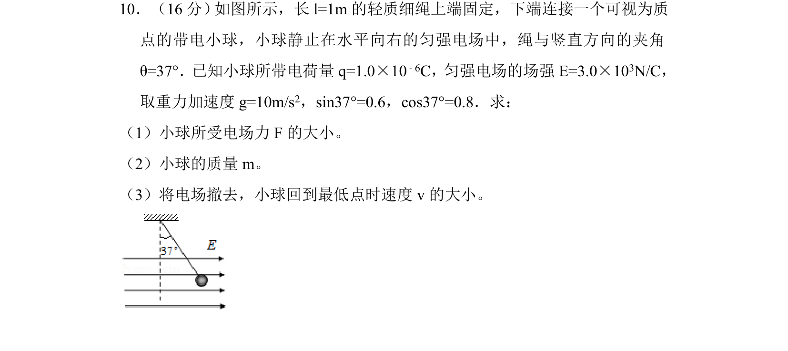
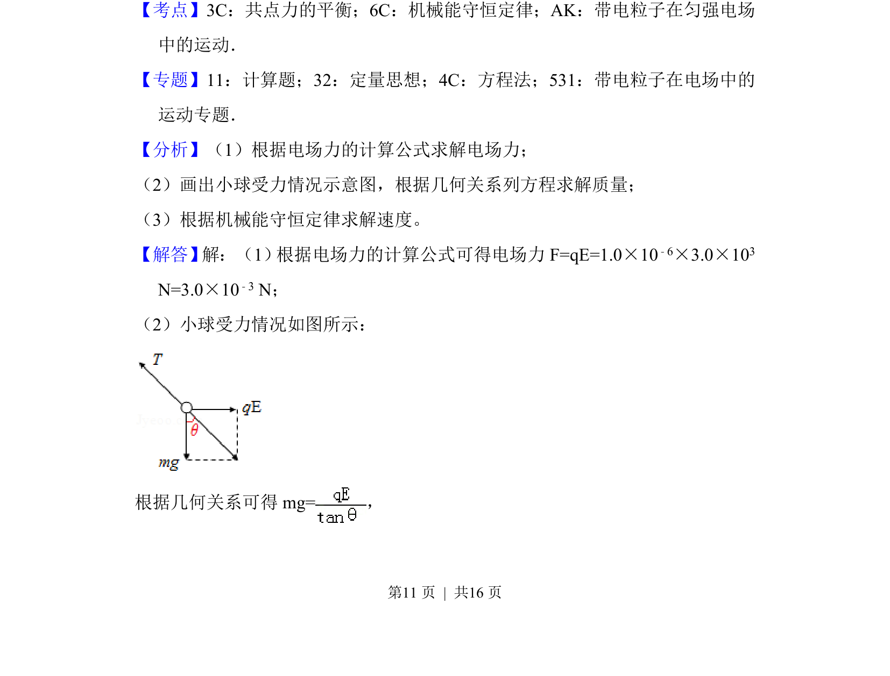
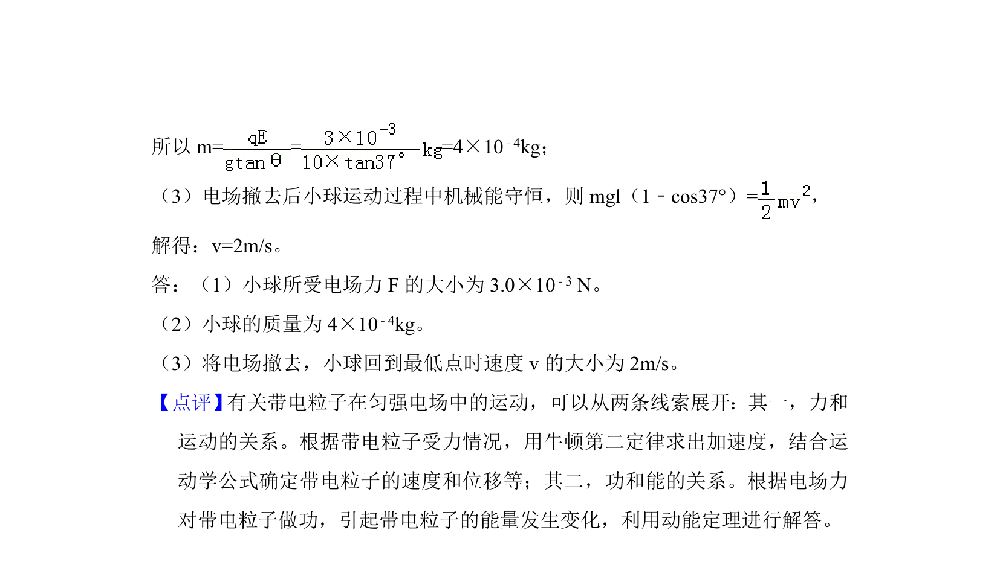

## 题面

## 摘要

带电小球在匀强电场中受电场力与重力平衡，撤去电场后利用机械能守恒求最低点速度。

## 关联考点

- [[784-共点力的平衡|共点力的平衡]]
- [[085-机械能守恒-初中|机械能守恒定律]]
- [[468-带电粒子在匀强电场中的运动|带电粒子在匀强电场中的运动]]

## 答案与解析

> 📄 原 PDF 第 11 页：`素材/真题/北京/2008-2024·（北京）物理高考真题/2017年高考物理试卷（北京）（解析卷）.pdf`
