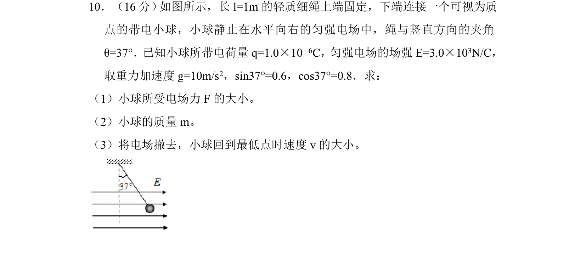
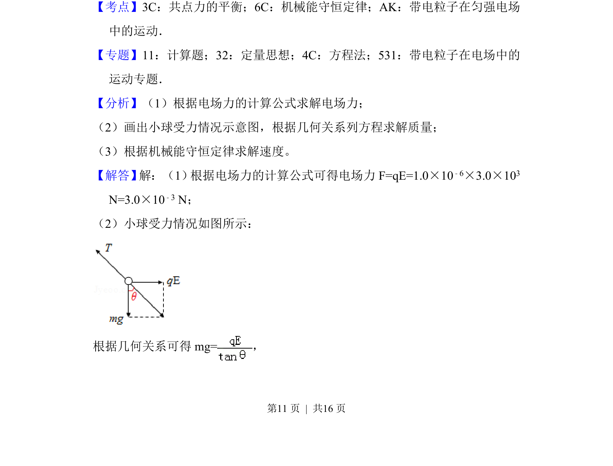
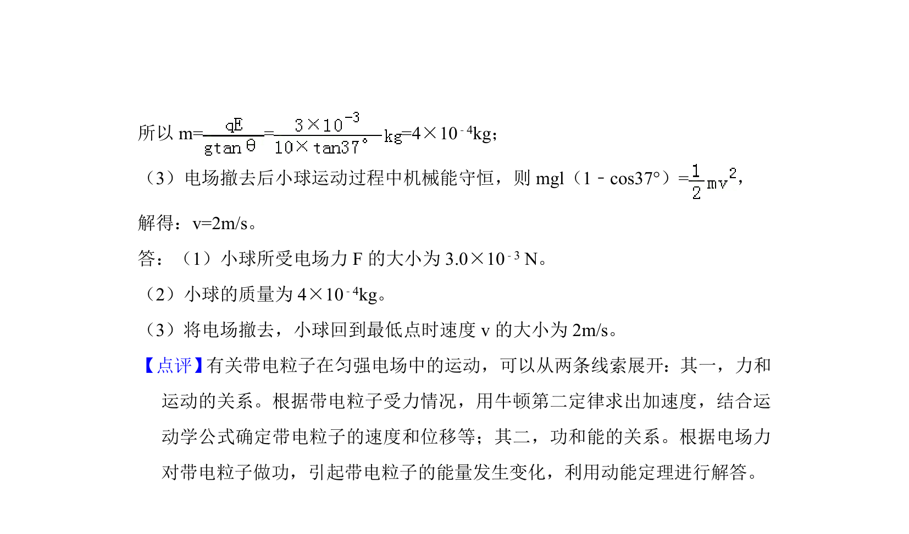

## 题面

## 摘要

带电小球在匀强电场中受电场力与重力平衡，撤去电场后利用机械能守恒求最低点速度。

## 关联考点

- [[208-共点力平衡|共点力的平衡]]
- [[085-机械能守恒-初中|机械能守恒定律]]
- [[468-带电粒子在匀强电场中的运动|带电粒子在匀强电场中的运动]]

## 答案与解析

> 📄 原 PDF 第 11 页：`素材/真题/北京/2008-2024·（北京）物理高考真题/2017年高考物理试卷（北京）（解析卷）.pdf`

<!-- 题干文本-start -->
## 题干文本
10．（16分） 如图所示，长l=1m的轻质细绳上端固定，下端连接一个可视为质
点的带电小球，小球静止在水平向右的匀强电场中，绳与竖直方向的夹角
θ=37°．已知小球所带电荷量q=1.0×10﹣6C，匀强电场的场强E=3.0×103N/C，
取重力加速度g=10m/s 2，sin37°=0.6，cos37°=0.8．求：
（1）小球所受电场力F的大小。
（2）小球的质量m。
（3）将电场撤去，小球回到最低点时速度v的大小。
<!-- 题干文本-end -->

<!-- 解析文本-start -->
## 解析文本
【考点】3C：共点力的平衡；6C：机械能守恒定律；AK：带电粒子在匀强电场
中的运动．菁优网版权所有
【专题】11：计算题；32：定量思想；4C：方程法；531：带电粒子在电场中的
运动专题．
【分析】（1）根据电场力的计算公式求解电场力；
（2）画出小球受力情况示意图，根据几何关系列方程求解质量；
（3）根据机械能守恒定律求解速度。
【解答】 解：（1） 根据电场力的计算公式可得电场力F=qE=1.0×10﹣6×3.0×103 
N=3.0×10﹣3 N；
（2）小球受力情况如图所示：
根据几何关系可得mg=，
<!-- 解析文本-end -->
