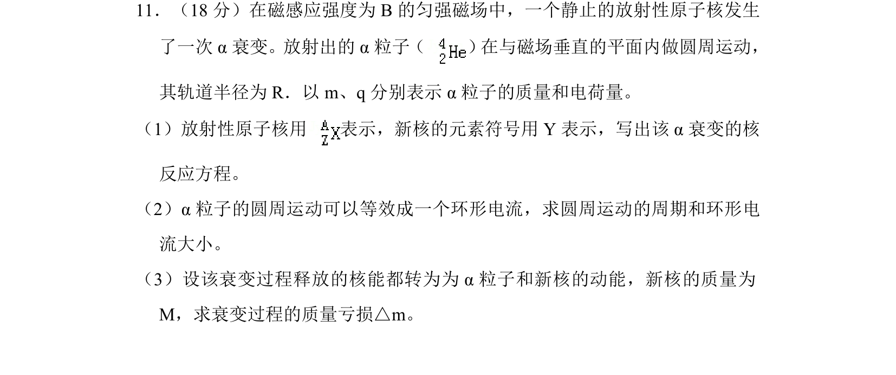
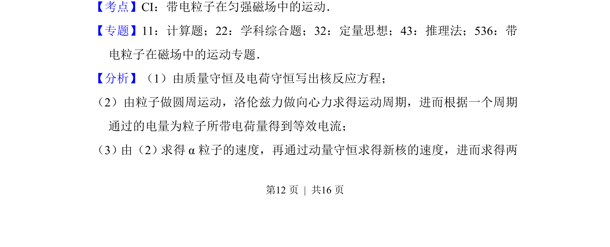
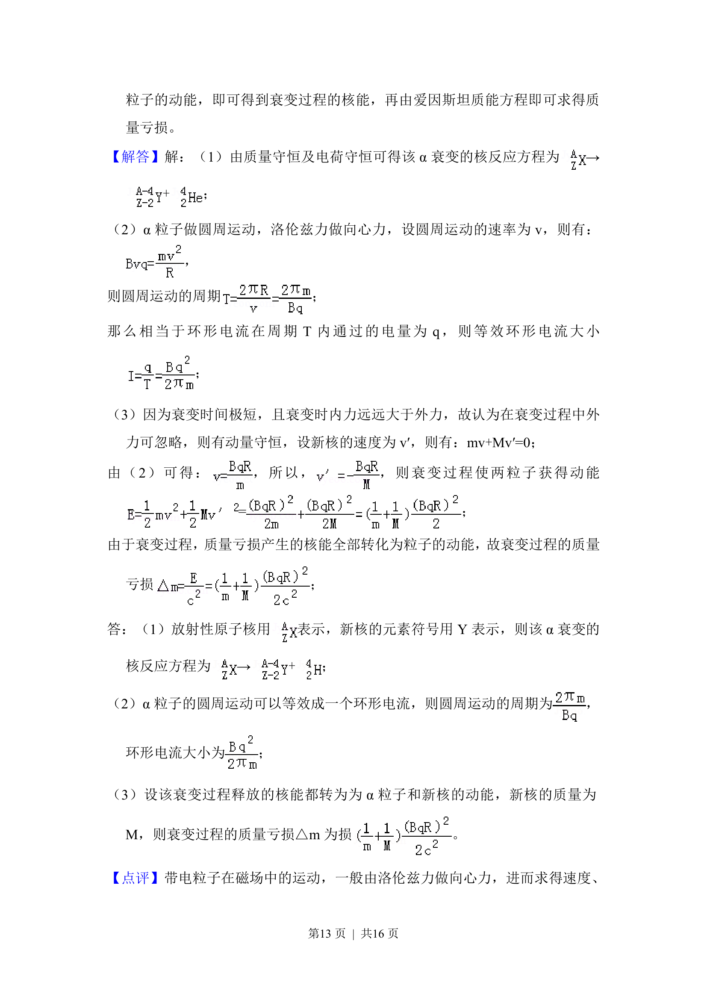

## 题面

## 摘要

α衰变结合带电粒子在磁场中匀速圆周运动，综合动量守恒与质能方程求质量亏损。

## 关联考点

- [[499-α衰变|α衰变]]
- [[595-带电粒子在匀强磁场中的运动|带电粒子在匀强磁场中的运动]]
- [[347-动量守恒定律|动量守恒定律]]
- [[449-质能方程|质能方程]]

## 答案与解析

> 📄 原 PDF 第 12 页：`素材/真题/北京/2008-2024·（北京）物理高考真题/2017年高考物理试卷（北京）（解析卷）.pdf`
