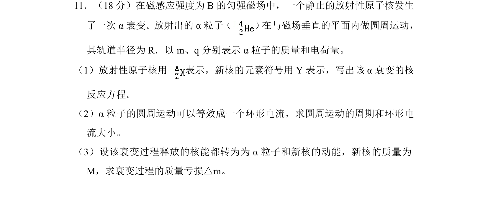
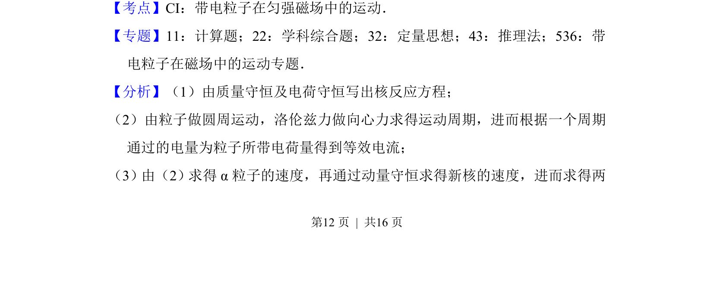
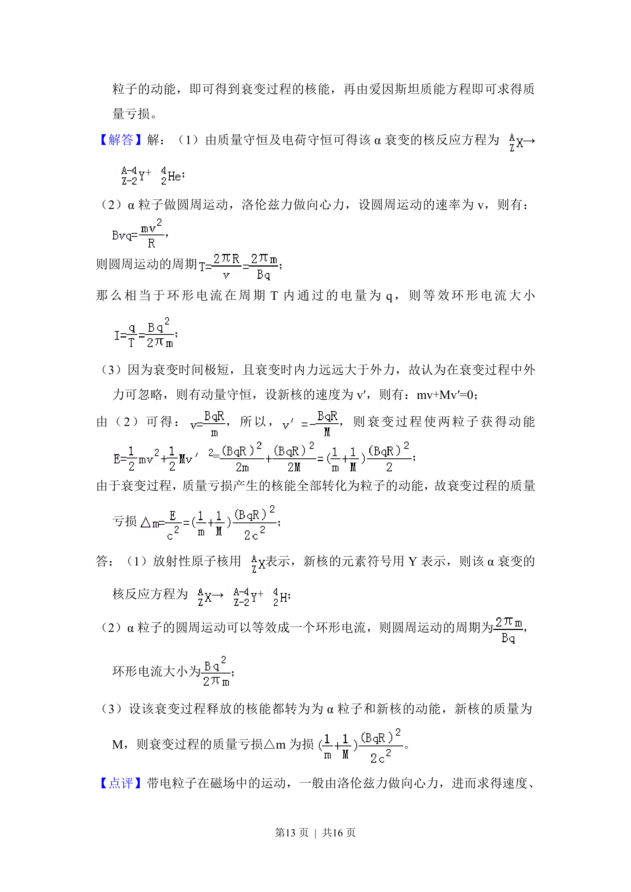

## 题面

## 摘要

α衰变结合带电粒子在磁场中匀速圆周运动，综合动量守恒与质能方程求质量亏损。

## 关联考点

- [[499-α衰变|α衰变]]
- [[595-带电粒子在匀强磁场中的运动|带电粒子在匀强磁场中的运动]]
- [[347-动量守恒定律|动量守恒定律]]
- [[449-质能方程|质能方程]]

## 答案与解析

> 📄 原 PDF 第 12 页：`素材/真题/北京/2008-2024·（北京）物理高考真题/2017年高考物理试卷（北京）（解析卷）.pdf`

<!-- 题干文本-start -->
## 题干文本
11．（18分）在磁感应强度为B的匀强磁场中，一个静止的放射性原子核发生
了一次α衰变。放射出的α粒子（ ） 在与磁场垂直的平面内做圆周运动，
其轨道半径为R．以m、q分别表示α粒子的质量和电荷量。
（1）放射性原子核用 表示，新核的元素符号用Y表示，写出该α衰变的核
反应方程。
（2）α粒子的圆周运动可以等效成一个环形电流，求圆周运动的周期和环形电
流大小。
（3）设该衰变过程释放的核能都转为为α粒子和新核的动能，新核的质量为
M，求衰变过程的质量亏损△m。
<!-- 题干文本-end -->

<!-- 解析文本-start -->
## 解析文本
【考点】CI：带电粒子在匀强磁场中的运动．菁优网版权所有
【专题】11：计算题；22：学科综合题；32：定量思想；43：推理法；536：带
电粒子在磁场中的运动专题．
【分析】（1）由质量守恒及电荷守恒写出核反应方程；
（2）由粒子做圆周运动，洛伦兹力做向心力求得运动周期，进而根据一个周期
通过的电量为粒子所带电荷量得到等效电流；
（3）由（2）求得α粒子的速度，再通过动量守恒求得新核的速度，进而求得两
<!-- 解析文本-end -->
