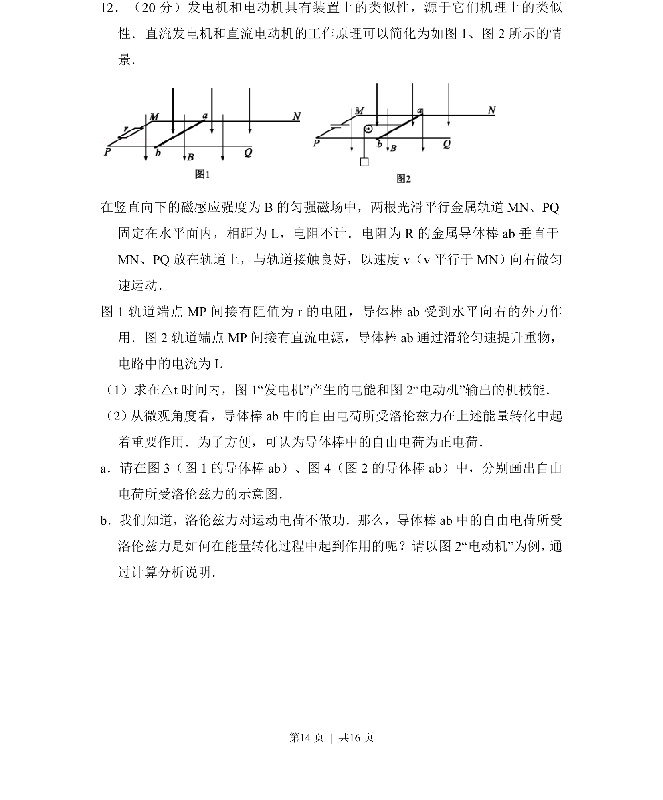
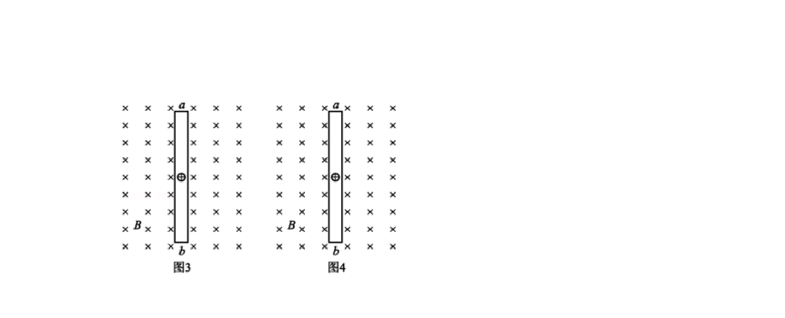
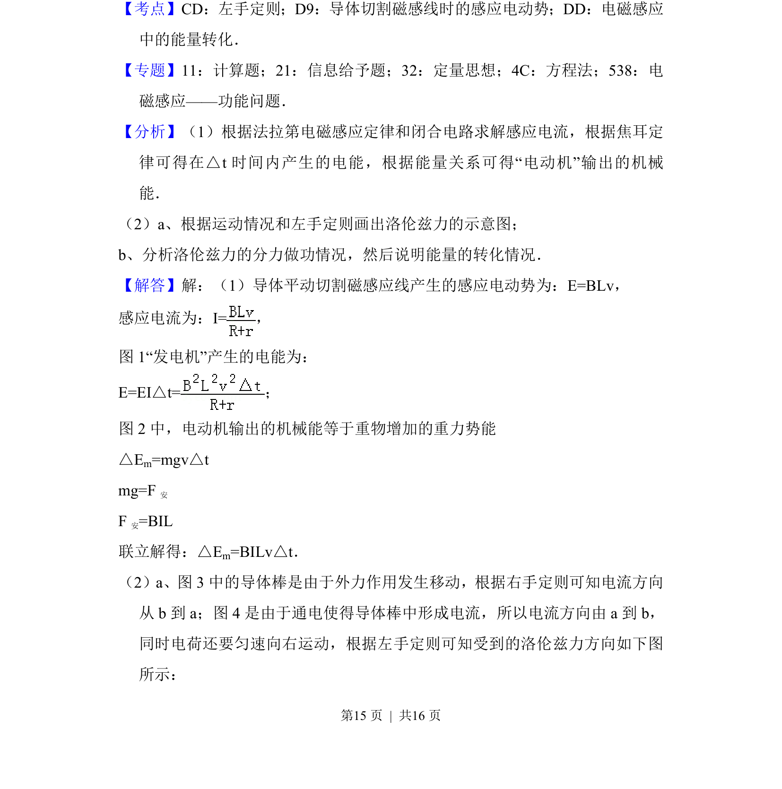
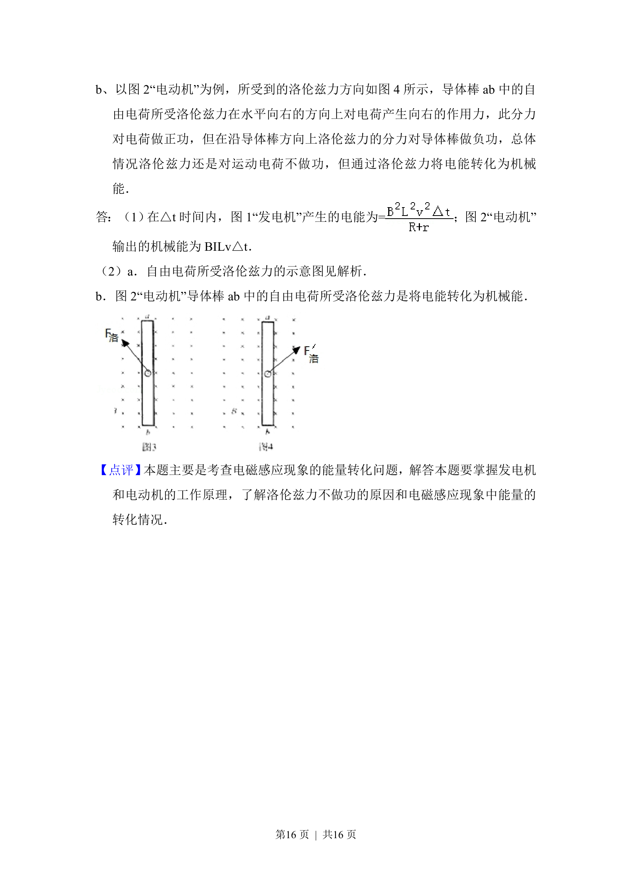

## 题面

## 摘要

该题以发电机和电动机模型为背景，考查电磁感应现象、能量转化及洛伦兹力的微观作用机制。

## 关联考点

- [[175-电磁感应|电磁感应]]
- [[188-磁场对通电导体的作用|安培力]]
- [[197-能量守恒定律|能量守恒]]
- [[304-洛伦兹力|洛伦兹力]]

## 答案与解析

> 📄 原 PDF 第 14 页：`素材/真题/北京/2008-2024·（北京）物理高考真题/2017年高考物理试卷（北京）（解析卷）.pdf`
