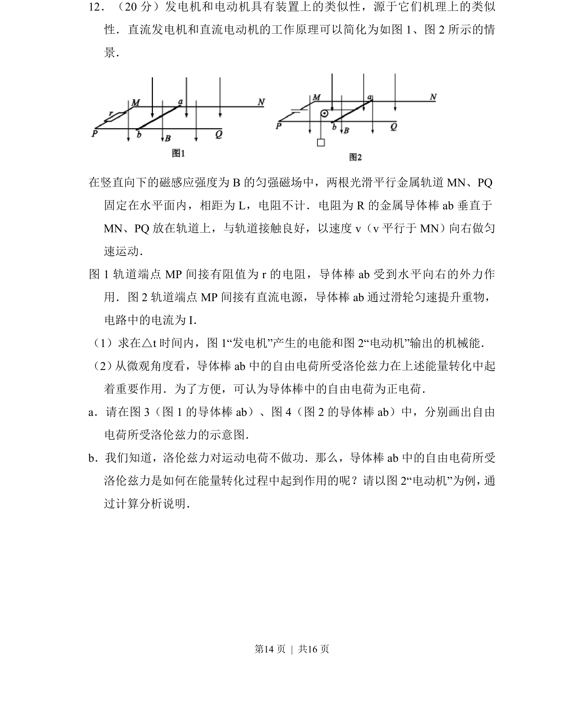
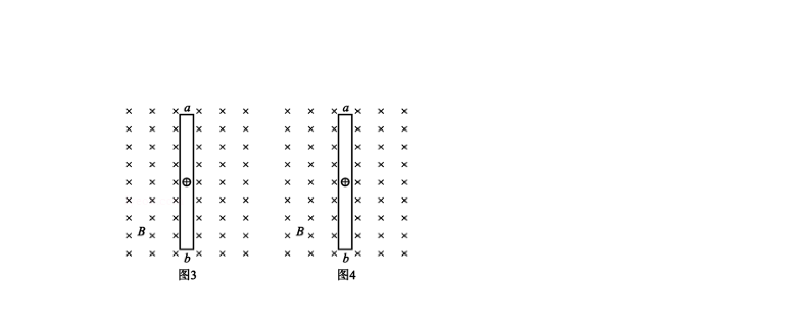
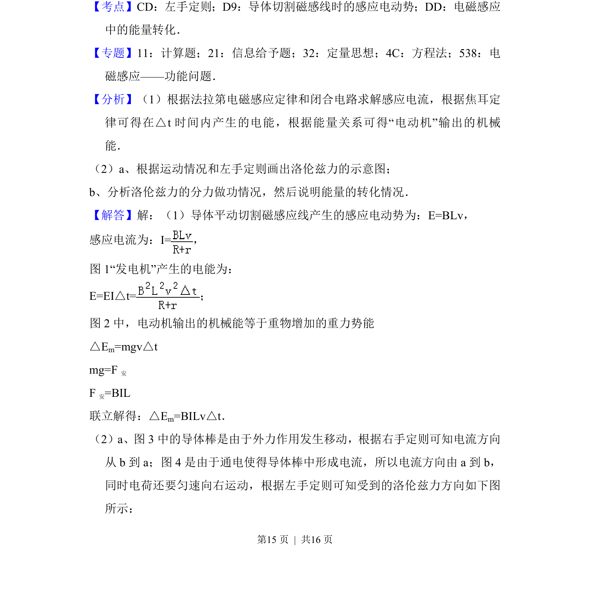
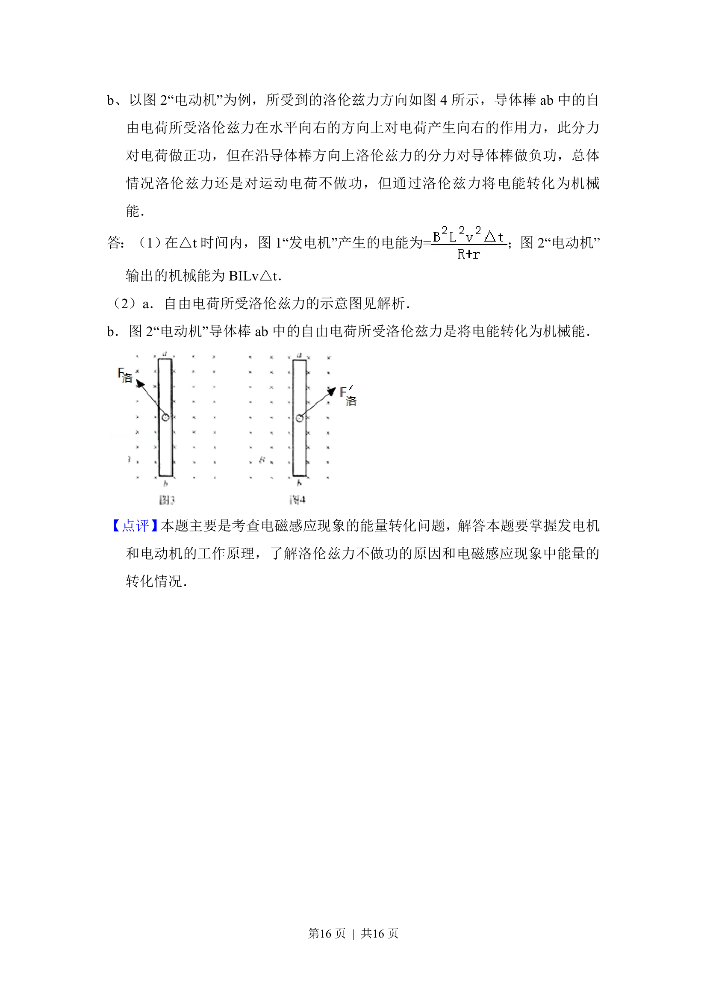

## 题面

## 摘要

该题以发电机和电动机模型为背景，考查电磁感应现象、能量转化及洛伦兹力的微观作用机制。

## 关联考点

- [[175-电磁感应|电磁感应]]
- [[188-磁场对通电导体的作用|安培力]]
- [[197-能量守恒定律|能量守恒]]
- [[304-洛伦兹力|洛伦兹力]]

## 答案与解析

> 📄 原 PDF 第 14 页：`素材/真题/北京/2008-2024·（北京）物理高考真题/2017年高考物理试卷（北京）（解析卷）.pdf`

<!-- 题干文本-start -->
## 题干文本
12．（20分）发电机和电动机具有装置上的类似性，源于它们机理上的类似
性．直流发电机和直流电动机的工作原理可以简化为如图1、图2所示的情
景．
在竖直向下的磁感应强度为B的匀强磁场中，两根光滑平行金属轨道MN、PQ
固定在水平面内，相距为L，电阻不计．电阻为R的金属导体棒ab垂直于
MN、PQ放在轨道上，与轨道接触良好，以速度v（v平行于MN）向右做匀
速运动．
图1轨道端点MP间接有阻值为r的电阻，导体棒ab受到水平向右的外力作
用．图2轨道端点MP间接有直流电源，导体棒ab通过滑轮匀速提升重物，
电路中的电流为I．
（1）求在△t时间内，图1“发电机”产生的电能和图2“电动机”输出的机械能．
（2） 从微观角度看，导体棒ab中的自由电荷所受洛伦兹力在上述能量转化中起
着重要作用．为了方便，可认为导体棒中的自由电荷为正电荷．
a．请在图3（图1的导体棒ab）、图4（图2的导体棒ab）中，分别画出自由
电荷所受洛伦兹力的示意图．
b．我们知道，洛伦兹力对运动电荷不做功．那么，导体棒ab中的自由电荷所受
洛伦兹力是如何在能量转化过程中起到作用的呢？请以图2“电动机”为例， 通
过计算分析说明．
<!-- 题干文本-end -->

<!-- 解析文本-start -->
## 解析文本

<!-- 解析文本-end -->
