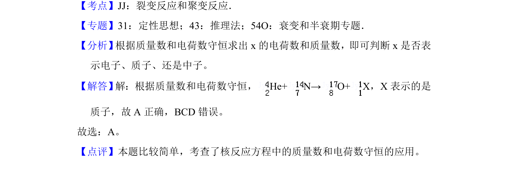

## 题面

## 摘要

根据质量数和电荷数守恒判断核反应方程中的未知粒子。

## 关联考点

- [[629-核反应方程|核反应方程]]
- [[728-质量数守恒|质量数守恒]]
- [[689-电荷数守恒|电荷数守恒]]

## 答案与解析

> 📄 原 PDF 第 1 页：`素材/真题/北京/2008-2024·（北京）物理高考真题/2018年高考物理试卷（北京）（解析卷）.pdf`
