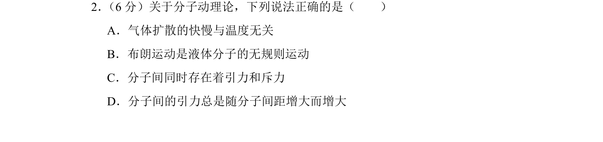
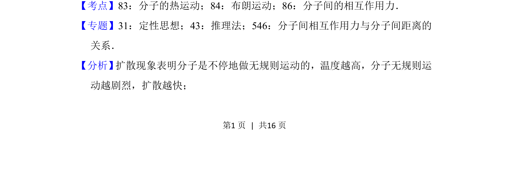
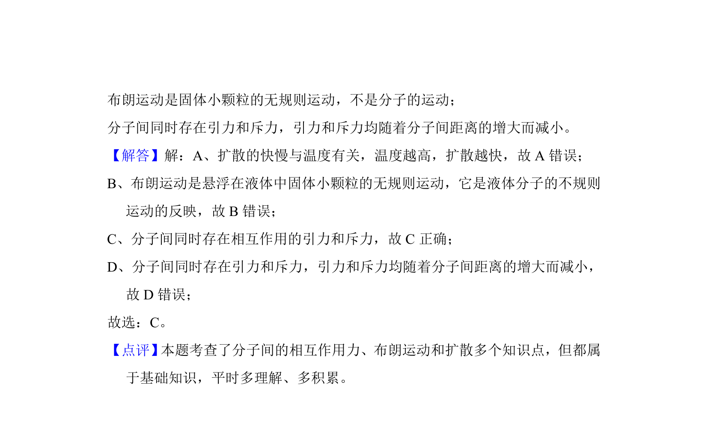

## 题面

## 摘要

本题通过分子动理论考查气体扩散、布朗运动以及分子间作用力的基本概念辨析。

## 关联考点

- [[130-分子热运动|分子的热运动]]
- [[130-分子热运动|布朗运动]]
- [[841-分子间的相互作用力|分子间的相互作用力]]

## 答案与解析

> 📄 原 PDF 第 1 页：`素材/真题/北京/2008-2024·（北京）物理高考真题/2018年高考物理试卷（北京）（解析卷）.pdf`

<!-- 题干文本-start -->
## 题干文本
2． （6分）关于分子动理论，下列说法正确的是（　　）
A．气体扩散的快慢与温度无关
B．布朗运动是液体分子的无规则运动
C．分子间同时存在着引力和斥力
D．分子间的引力总是随分子间距增大而增大
<!-- 题干文本-end -->

<!-- 解析文本-start -->
## 解析文本
【考点】83：分子的热运动；84：布朗运动；86：分子间的相互作用力．菁优网版权所有
【专题】31：定性思想；43：推理法；546：分子间相互作用力与分子间距离的
关系．
【分析】 扩散现象表明分子是不停地做无规则运动的，温度越高，分子无规则运
动越剧烈，扩散越快；
<!-- 解析文本-end -->
