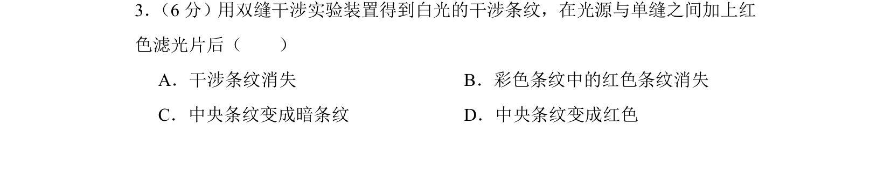
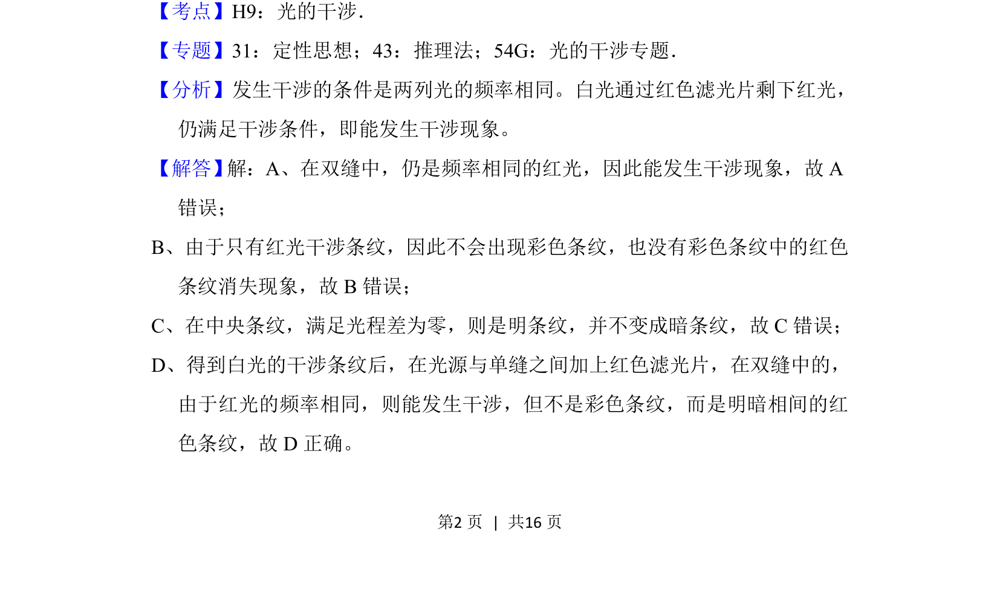
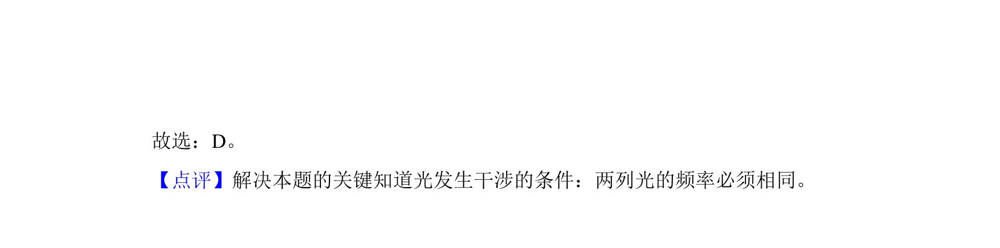

## 题面

## 摘要

在双缝干涉实验中，加入红色滤光片后仅剩红光，仍满足干涉条件，中央明纹变为红色。

## 关联考点

- [[340-光的干涉|光的干涉]]
- [[552-双缝干涉|双缝干涉]]
- [[滤光片]]
- [[光的频率]]

## 答案与解析

> 📄 原 PDF 第 2 页：`素材/真题/北京/2008-2024·（北京）物理高考真题/2018年高考物理试卷（北京）（解析卷）.pdf`
