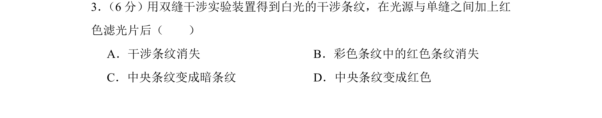
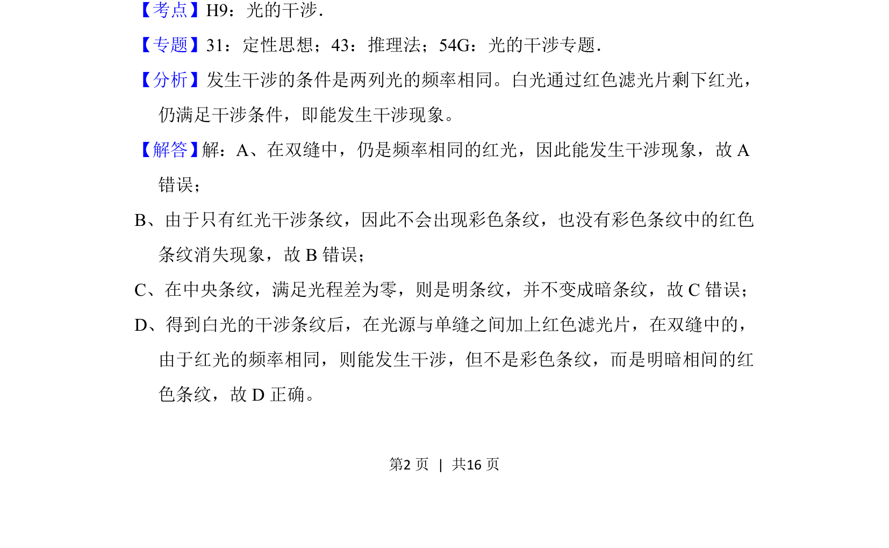
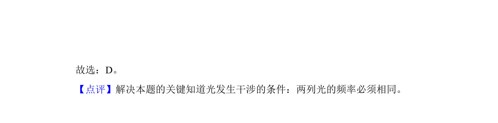

## 题面

## 摘要

在双缝干涉实验中，加入红色滤光片后仅剩红光，仍满足干涉条件，中央明纹变为红色。

## 关联考点

- [[340-光的干涉|光的干涉]]
- [[552-双缝干涉|双缝干涉]]
- [[滤光片]]
- [[光的频率]]

## 答案与解析

> 📄 原 PDF 第 2 页：`素材/真题/北京/2008-2024·（北京）物理高考真题/2018年高考物理试卷（北京）（解析卷）.pdf`

<!-- 题干文本-start -->
## 题干文本
3． （6分）用双缝干涉实验装置得到白光的干涉条纹，在光源与单缝之间加上红
色滤光片后（　　）
A．干涉条纹消失B．彩色条纹中的红色条纹消失
C．中央条纹变成暗条纹D．中央条纹变成红色
<!-- 题干文本-end -->

<!-- 解析文本-start -->
## 解析文本
【考点】H9：光的干涉．菁优网版权所有
【专题】31：定性思想；43：推理法；54G：光的干涉专题．
【分析】发生干涉的条件是两列光的频率相同。白光通过红色滤光片剩下红光，
仍满足干涉条件，即能发生干涉现象。
【解答】 解：A、在双缝中，仍是频率相同的红光，因此能发生干涉现象，故A
错误；
B、由于只有红光干涉条纹，因此不会出现彩色条纹，也没有彩色条纹中的红色
条纹消失现象，故B错误；
C、在中央条纹，满足光程差为零，则是明条纹，并不变成暗条纹，故C错误；
D、得到白光的干涉条纹后，在光源与单缝之间加上红色滤光片，在双缝中的，
由于红光的频率相同，则能发生干涉，但不是彩色条纹，而是明暗相间的红
色条纹，故D正确。
<!-- 解析文本-end -->
