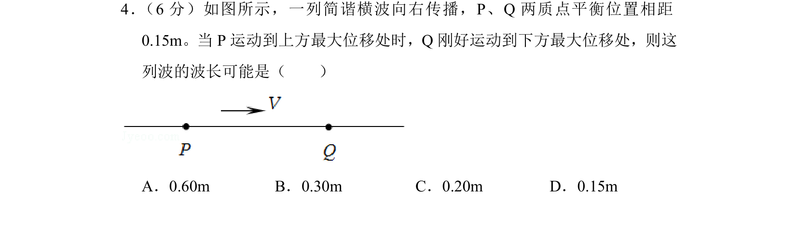
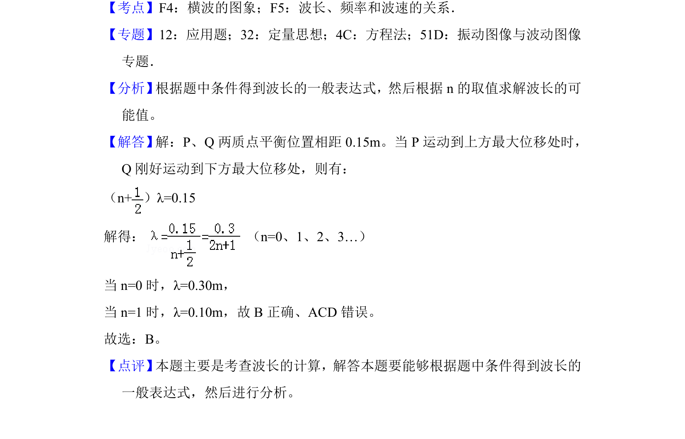

## 题面

## 摘要

根据质点振动位置关系推导波长，通过条件列方程求解可能值。

## 关联考点

- [[630-横波的图象|横波的图象]]
- [[370-波长|波长]]
- [[749-频率和波速的关系|频率和波速的关系]]
- [[763-质点振动|质点振动]]

## 答案与解析

> 📄 原 PDF 第 3 页：`素材/真题/北京/2008-2024·（北京）物理高考真题/2018年高考物理试卷（北京）（解析卷）.pdf`
