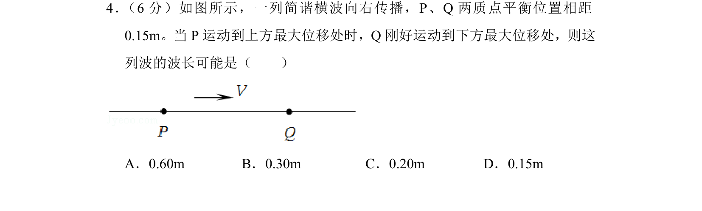
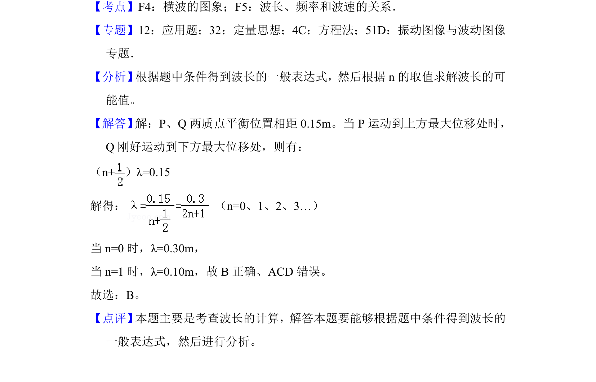

## 题面

## 摘要

根据质点振动位置关系推导波长，通过条件列方程求解可能值。

## 关联考点

- [[630-横波的图象|横波的图象]]
- [[370-波长|波长]]
- [[749-频率和波速的关系|频率和波速的关系]]
- [[763-质点振动|质点振动]]

## 答案与解析

> 📄 原 PDF 第 3 页：`素材/真题/北京/2008-2024·（北京）物理高考真题/2018年高考物理试卷（北京）（解析卷）.pdf`

<!-- 题干文本-start -->
## 题干文本
4． （6分）如图所示，一列简谐横波向右传播，P、Q两质点平衡位置相距
0.15m。当P运动到上方最大位移处时，Q刚好运动到下方最大位移处，则这
列波的波长可能是（　　）
A．0.60m B．0.30m C．0.20m D．0.15m
<!-- 题干文本-end -->

<!-- 解析文本-start -->
## 解析文本
【考点】F4：横波的图象；F5：波长、频率和波速的关系．菁优网版权所有
【专题】12：应用题；32：定量思想；4C：方程法；51D：振动图像与波动图像
专题．
【分析】 根据题中条件得到波长的一般表达式，然后根据n的取值求解波长的可
能值。
【解答】 解：P、Q两质点平衡位置相距0.15m。当P运动到上方最大位移处时，
Q刚好运动到下方最大位移处，则有：
（n+）λ=0.15
解得： （n=0、1、2、3…）
当n=0时，λ=0.30m，
当n=1时，λ=0.10m，故B正确、ACD错误。
故选：B。
【点评】 本题主要是考查波长的计算，解答本题要能够根据题中条件得到波长的
一般表达式，然后进行分析。
<!-- 解析文本-end -->
