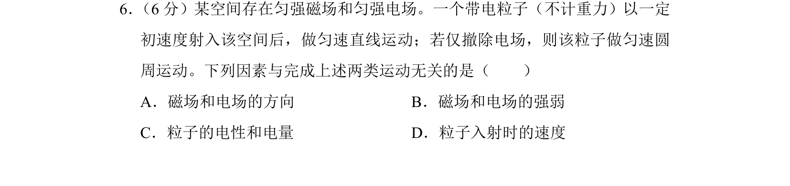
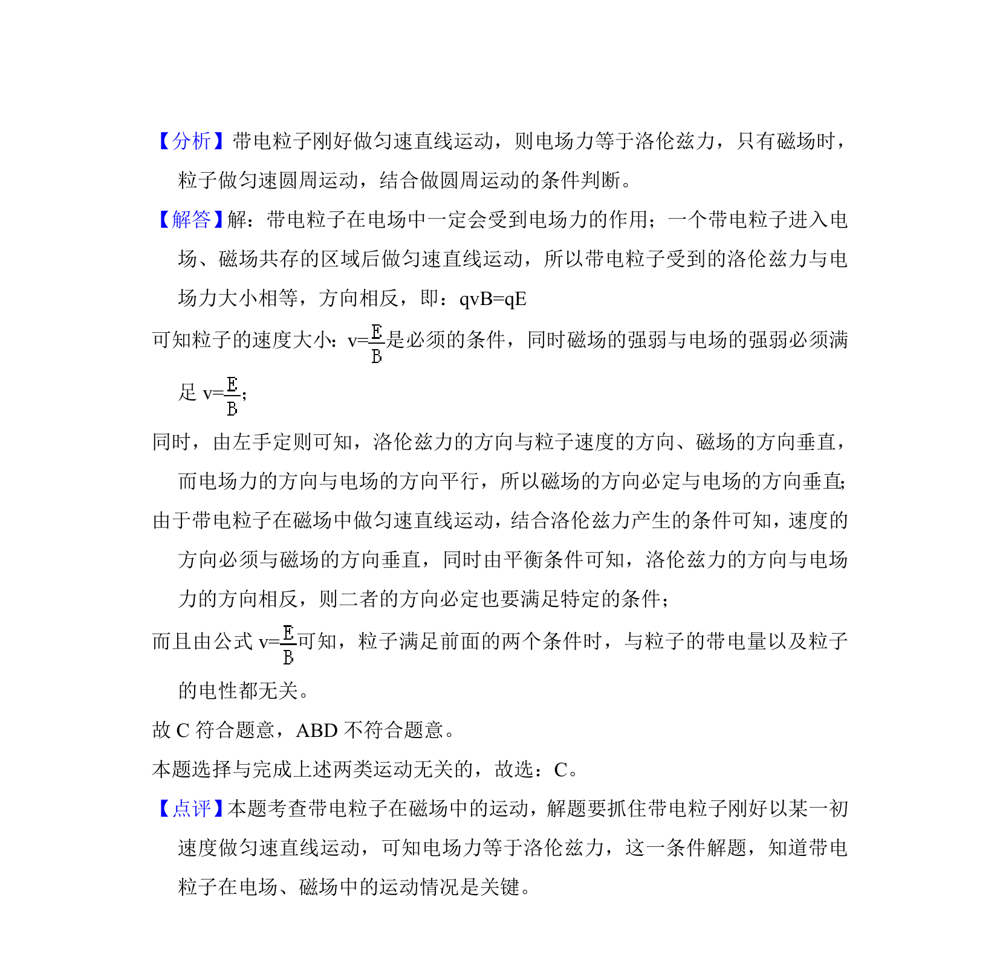

## 题面

## 摘要

带电粒子在电磁场中做匀速直线运动与匀速圆周运动的条件分析

## 关联考点

- [[844-带电粒子在复合场中的运动|带电粒子在复合场中的运动]]
- [[672-电场力|电场力]]
- [[304-洛伦兹力|洛伦兹力]]
- [[运动条件]]

## 答案与解析

> 📄 原 PDF 第 4 页：`素材/真题/北京/2008-2024·（北京）物理高考真题/2018年高考物理试卷（北京）（解析卷）.pdf`
