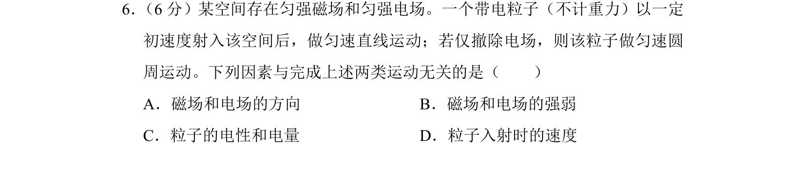
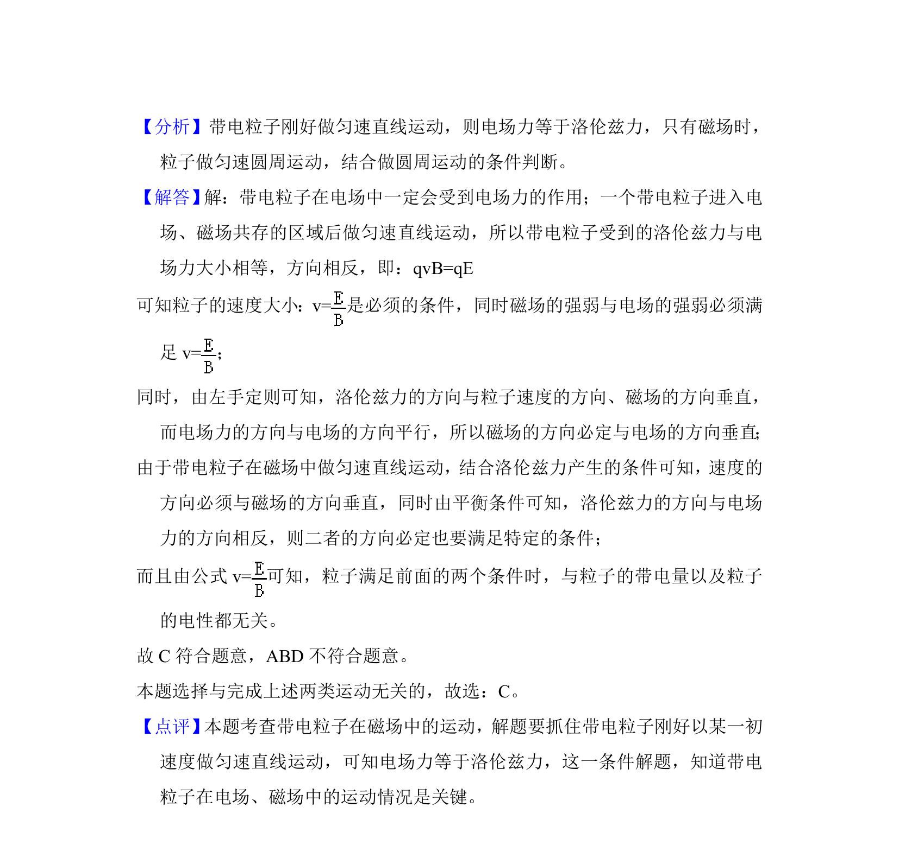

## 题面

## 摘要

带电粒子在电磁场中做匀速直线运动与匀速圆周运动的条件分析

## 关联考点

- [[844-带电粒子在复合场中的运动|带电粒子在复合场中的运动]]
- [[672-电场力|电场力]]
- [[304-洛伦兹力|洛伦兹力]]
- [[运动条件]]

## 答案与解析

> 📄 原 PDF 第 4 页：`素材/真题/北京/2008-2024·（北京）物理高考真题/2018年高考物理试卷（北京）（解析卷）.pdf`

<!-- 题干文本-start -->
## 题干文本
6． （6分）某空间存在匀强磁场和匀强电场。一个带电粒子（不计重力）以一定
初速度射入该空间后，做匀速直线运动；若仅撤除电场，则该粒子做匀速圆
周运动。下列因素与完成上述两类运动无关的是（　　）
A．磁场和电场的方向B．磁场和电场的强弱
C．粒子的电性和电量D．粒子入射时的速度
<!-- 题干文本-end -->

<!-- 解析文本-start -->
## 解析文本
【考点】CM：带电粒子在混合场中的运动．菁优网版权所有
【专题】31：定性思想；43：推理法；537：带电粒子在复合场中的运动专题．
<!-- 解析文本-end -->
