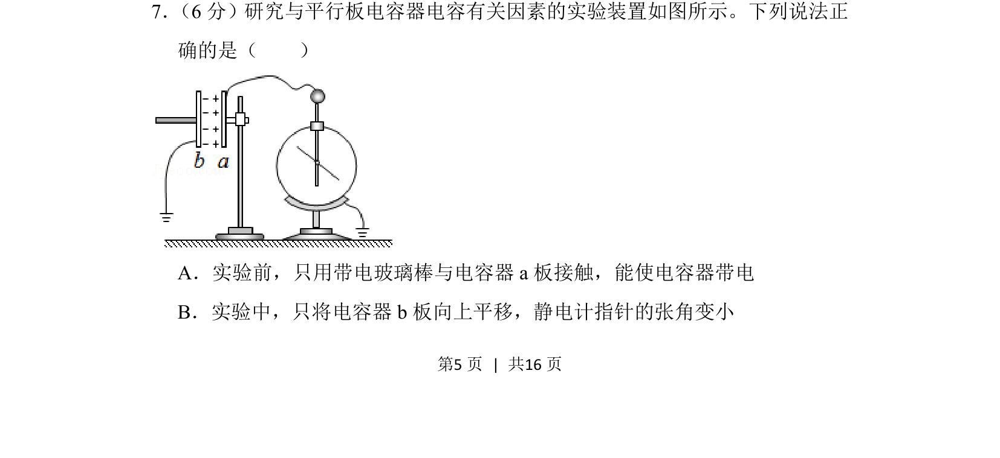
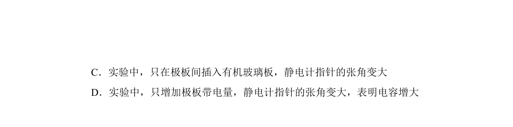
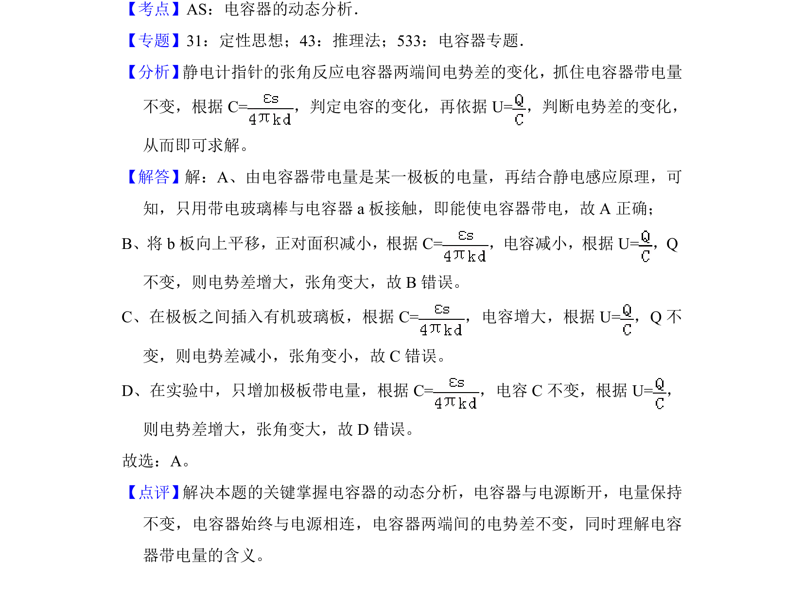

## 题面

## 摘要

通过实验分析平行板电容器带电方式及极板移动对静电计指针张角的影响。

## 关联考点

- [[802-平行板电容器|平行板电容器]]
- [[312-电容|电容]]
- [[静电计]]
- [[163-电压|电压]]

## 答案与解析

> 📄 原 PDF 第 5 页：`素材/真题/北京/2008-2024·（北京）物理高考真题/2018年高考物理试卷（北京）（解析卷）.pdf`
