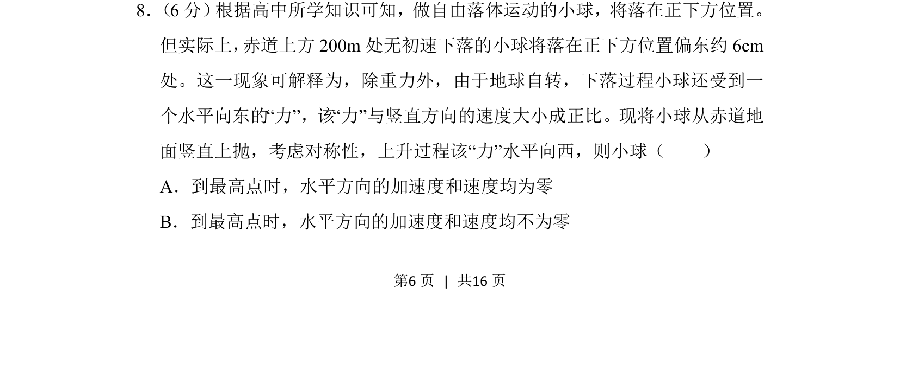
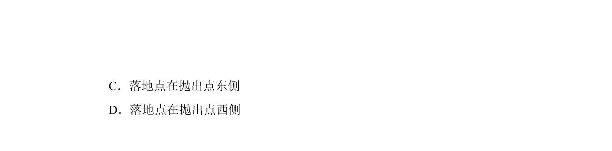
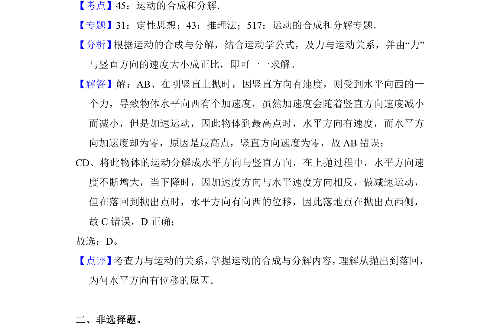

## 题面

## 摘要

考查地球自转影响下，竖直上抛小球水平方向的加速度与速度变化。

## 关联考点

- [[288-运动的合成与分解|运动的合成与分解]]
- [[229-牛顿第二定律|牛顿第二定律]]
- [[280-相对运动|相对运动]]

## 答案与解析

> 📄 原 PDF 第 6 页：`素材/真题/北京/2008-2024·（北京）物理高考真题/2018年高考物理试卷（北京）（解析卷）.pdf`
